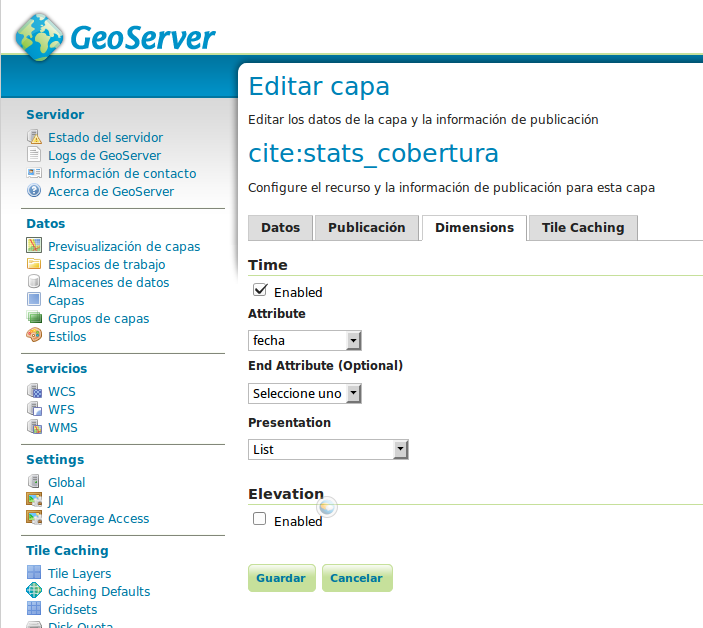

> |	Fecha      |        Autores   |
> | -- | -- |
> |  16 Marzo 2015  |  Fernando González (fernando.gonzalez@fao.org) |
> |  17 Enero 2018  |  Micho García (micho.garcia@geomati.co) |
>
> ©2013 FAO Forestry
>
> Excepto donde quede reflejado de otra manera, la presente documentación se halla bajo licencia : Creative Commons (Creative Commons - Attribution - Share Alike: http://creativecommons.org/licenses/by-sa/3.0/deed.es)

La configuración de capas temporales consta de tres etapas:

1. Preparación de los datos
2. Publicación en GeoServer
3. Configuración de la capa en el portal

Los dos primeros pasos dependen del tipo de datos que se quiere publicar, vectorial o raster.

## Preparación y publicación de capas vectoriales

La preparación consistirá en introducir una columna de tipo fecha con la fecha para la cual ese registro es válido. Esto se puede realizar para shapefiles o para bases de datos PostGIS indistintamente, pero el campo ha de ser de tipo fecha.

La publicación en GeoServer se hace exactamente igual al de cualquier otra capa y la diferencia es que una vez la capa está publicada, hay que ir a la pestaña "Dimensiones" de la capa en cuestión y habilitar el checkbox para Tiempo. En el combo que aparece como "Atributo" hay que seleccionar el campo fecha añadido anteriormente, y para "Presentación" hay que seleccionar "List". Una vez esta configuración se guarda, la capa ya está preparada para servirse en distintas instancias temporales.

## Configuración de la capa en el portal

La configuración de la capa en el portal sólo implica añadir un atributo "timeInstances" al elemento ``portalLayer``::

	{
			"id" : "mascara_forestal",
			"label" : "Máscara forestal",
			"layers" : [ "forest_mask_wms" ],
			"timeInstances" : "2000-01-01T00:00:00.000Z,2005-01-01T00:00:00.000Z,2010-01-01T00:00:00.000Z"
	}

El formato del atributo es una lista de fechas separadas por comas en la que cada fecha tiene el siguiente formato:  **yyyy-MM-ddTHH:mm:ssZ**, donde:

* **yyyy** es el año
* **MM** es el mes
* **dd** es el día del mes
* **T** separa fecha y hora
* **HH** es la hora en formato 24h
* **mm** son los minutos
* **ss** son los segundos
* **Z** indica el final de la fecha

 >   Anteriormente este parámetro se llamába ``wmsTime`` y se configuraba en los elementos ``wmsLayer`` por lo que es posible encontrar algún fichero con el formato antiguo que esté configurado de esta manera.Portal: Configuración de capas temporales
