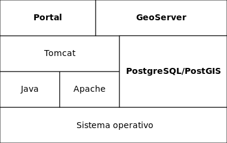

> | Fecha         | Autores                                         |
> |---------------|-------------------------------------------------|
> | 24 Junio 2013 | Fernando González (<fernando.gonzalez@fao.org>) |
> | 9  Enero 2018 | Víctor González (<victor.gonzalez@fao.org>)  |
>
> ©2013 FAO Forestry
>
> Excepto donde quede reflejado de otra manera, la presente documentación se halla bajo licencia [Creative Commons](http://creativecommons.org/licenses/by-sa/3.0/deed.es).

En esta documentación veremos la instalación y configuración de los componentes necesarios para la diseminación de datos espaciales. Los componentes fundamentales del sistema son:

* Una base de datos **PostgreSQL**.
* Una instancia de **GeoServer** (corriendo sobre Apache Tomcat).
* Una instancia del **portal** de diseminación (corriendo sobre Apache Tomcat).

En el siguiente diagrama podemos observar estos componentes, junto con otros de más bajo nivel sobre los que se apoyan (Java, Apache, ...):

Para poder instalar estos componentes, en esta documentación asumimos que contamos con:

* Los **datos** listos para su publicación, tanto vectoriales (*shapefiles*) como raster (*GeoTIFF*).
* Un **servidor** con acceso público a Internet y posibilidad de realizar tareas administrativas (instalación, modificación de ficheros, etc.) en dicho servidor.

Una vez el sistema esté instalado se podrá conectar a los diferentes componentes de varias maneras:

- A **GeoServer** (*HTTP*) para configurar los servicios OGC, mapas, etc.
- Al **portal** (*HTTP*) para visualizar los datos.
- A la **base de datos** (*PostGIS*) desde un cliente GIS (por ejemplo, QGIS) para visualizar y editar los datos.
- Al **sistema operativo** (*SFTP*) para transferencia de archivos de configuración y/o recursos estáticos (imágenes, iconos, etc.).
- Al **sistema operativo** (*SSH*) para realizar otras tareas administrativas (instalación y configuración de software, copias de seguridad, etc.).

Los pasos a seguir para instalar el sistema son los siguientes:

* [Inventario](inventory.md).
* [Instalación del servidor](install.md).
* [Carga de datos en PostGIS](postgis.md).
* [Publicación de datos en GeoServer](geoserver.md).
* [Configuración del portal](portal.md).
* [Optimizaciones](optimization.md).
