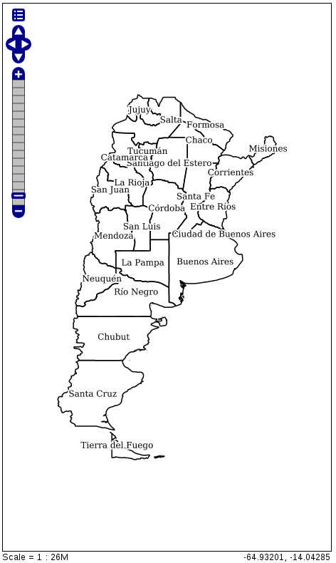
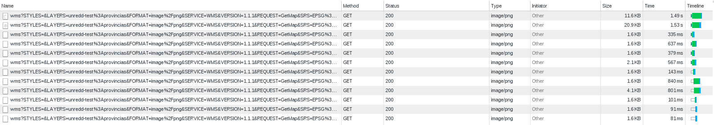
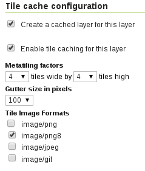

Resolviendo el problema de las etiquetas
----------------------------------------

Descripción del problema
....................................

Tenemos una capa de provincias, de la que disponemos de las geometrías del polígono y de un campo con el nombre de la provincia. Se quiere publicar en un servidor de mapas, de manera que se muestre el polígono de la provincia y en un punto interior el nombre de la misma. 

Para ello, mediante el uso de GeoServer, publicamos la capa y le aplicamos el siguiente estilo::

    <?xml version="1.0" encoding="UTF-8"?>
    <StyledLayerDescriptor version="1.0.0" xmlns="http://www.opengis.net/sld" xmlns:ogc="http://www.opengis.net/ogc"
  xmlns:xlink="http://www.w3.org/1999/xlink" xmlns:xsi="http://www.w3.org/2001/XMLSchema-instance"
  xsi:schemaLocation="http://www.opengis.net/sld http://schemas.opengis.net/sld/1.0.0/StyledLayerDescriptor.xsd">
  <!--  simbologia_adm_prov_4326 -->
  <!-- http://geo2.ambiente.gob.ar/geoserver/bosques_umsef_db/wms?service=WMS&version=1.1.0&request=GetMap&layers=bosques_umsef_db:limites_provinciales&styles=&bbox=-73.566302817,-52.394802778,-53.637962552,-21.777951173&width=333&height=512&srs=EPSG:4326&format=application/openlayers&TIME=1999 -->
  
  <NamedLayer>
    <Name>Blue lake</Name>
    <UserStyle>
      <Title>Blue lake</Title>
      <Abstract>A blue fill, solid black outline style</Abstract>
      <FeatureTypeStyle>
        <Rule>
          <Name>name</Name>
          <PolygonSymbolizer>
            <Fill>
              <CssParameter name="fill">
                <ogc:Literal>#ffffff</ogc:Literal>
              </CssParameter>
              <CssParameter name="fill">
                <ogc:Literal>1.0</ogc:Literal>
              </CssParameter>
            </Fill>
          </PolygonSymbolizer>
               <LineSymbolizer>
            <Stroke>
              <CssParameter name="stroke">#000000</CssParameter>
                <CssParameter name="stroke-width">1</CssParameter>
            </Stroke>
               </LineSymbolizer>
          <TextSymbolizer>
           <Geometry>
     <ogc:Function name="interiorPoint">
       <ogc:PropertyName>the_geom</ogc:PropertyName>
     </ogc:Function>
       </Geometry>
               <Label>
                  <ogc:PropertyName>NAME_1</ogc:PropertyName>
                </Label>
                <LabelPlacement>
                  <PointPlacement>
                    <AnchorPoint>
                      <AnchorPointX>0.5</AnchorPointX>
                      <AnchorPointY>0.5</AnchorPointY>
                    </AnchorPoint>
                  </PointPlacement>
                </LabelPlacement>
                <Halo>
                  <Radius>
                    <ogc:Literal>2</ogc:Literal>
                  </Radius>
                  <Fill>
                    <CssParameter name="fill">#FFFFFF</CssParameter>
                  </Fill>
                </Halo>
                <Fill>
                  <CssParameter name="fill">#000000</CssParameter>
                </Fill>
                <VendorOption name="goodnessOfFit">0</VendorOption>
                <VendorOption name="conflictResolution">false</VendorOption>
              </TextSymbolizer>
                  </Rule>
          </FeatureTypeStyle>
        </UserStyle>
      </NamedLayer>
    </StyledLayerDescriptor>
    
    
De esta manera, publicada la capa, podremos observar a través de la previsualización de capas, que el aspecto de la capa es el siguiente:

En este momento la capa se está sirviendo como una sola imagen. Esto lo podremos comprobar en la pestaña de ``Red`` de las herramientas de desarrollo de nuestro navegador (Google Chrome en este caso):

Para conseguir una mejor experiencia de usuario, se usa las peticiones teseladas, que consiste en particionar la imagen total en varias de menor tamaño, tiles (teselas), y de esta manera la descarga de la imagen se realiza en multiples imagenes que unidas componen la imagen total. En nuestro caso, para definir el uso de las teselas, podremos, desde el previsualizador de capas, en los parámetros adicionales:

.. image:: _static/metatiles/aditional_parameters.png

Desde la barra de parámetros opcionales, podremos definir que nos devuelva la imagen teselada, para ello en la opción **Tilling**, seleccionamos **Tiled**. Podremos comprobar en la pestaña de ``Red`` de nuestras herramientas de desarrollo que ahora en vez de realizar una única petición, realiza varias, una por cada tesela, para componer la imagen total:

La diferencia es que en este último caso, cada petición realizada por el cliente, se trata de una parte de la imagen global:

.. image:: _static/metatiles/single_tile.png

El problema que aparece es que en algunas provincias, desaparecen las etiquetas con los nombres. Según variemos el zoom, podremos observar que estas etiquetas van apareciendo y desapareciendo de manera aleatoria.

Esto es debido al proceso de creación de las teselas. Lo que sucede es que en el momento de definir la tesela, el servidor comprueba que la etiqueta esté completamente incluida en la tesela, y en caso contrario, delega la creación de la etiqueta en otra tesela, pero, si como en este caso, la etiqueta no vuelve a encajar dentro de otra tesela, esta etiqueta no será dibujada. Como se observa en la siguente figura, para la provincia por encima de Rio Negro y debajo de Mendoza, que aparece sin etiqueta, se puede ver como el límite de la tesela, coincide justo con la posición donde estaría la etiqueta.

.. image:: _static/metatiles/tile_not_label.png

Solución 1: Metatileado
....................................

Las metatiles son tiles creadas de la combinación de varias tiles. Su beneficio es que el servidor de mapas genera el contenido de las tiles a partir de una metatile creada anteriormente y que después se partirá en el número de tiles necesario.

.. image:: _static/metatiles/metatile.png

En la imagen anterior podemos observar una metatile 3x3, que está compuesta por 9 tiles. 
Además de la composición en N tiles, las metatiles disponen de una parte que es el buffer, que será tenida en cuenta a la hora de generar la metatile, pero que no se mostrará en las teselas resultantes de la metatile. 

.. image:: _static/metatiles/metatile_gutter.png

El objetivo de este buffer es permitir que las etiquetas, marcadores, etc, que se encuentran en los límites de la metatile, se dibujen correctamente ya que estos elementos serán tenidos en cuenta en la generación de las teselas de esa metatile.

Implementación del metatileado en GeoServer
^^^^^^^^^^^^^^^^^^^^^^^^^^^^^^^^^^^^^^^^^^^

GeoWebCache, integrado en GeoServer es el que aporta la solución del metatileado a este servidor de mapas. Para aplicar este:

vamos a la pestaña ``Tile Caching`` de nuestra capa publicada en GeoServer

en las opciones de ``Tile cache configuration`` selecciones los siguientes valores:

* Seleccionamos ``Create a cached layer for this layer``
* Seleccionamos ``Enable tile caching for this layer``
* En ``Metatiling Factors`` seleccionamos valores 4 ``tiles wide`` por 4 ``tiles high``
* Seleccionamos un tamaño de Gutter (buffer) de 100 pixels

De esta manera, se generará una metatile de 4x4, con un buffer de 100px.

Ahora podremos consumir desde nuestro cliente la capa que se está `sirviendo a través de GeoWebCache`_, bien usando la URL asociada a esta capa:

.. note::
    
    http://example.com/geoserver/gwc/service/wms
    
o mediante el uso de las peticiones GetMap del WMS siempre que GeoServer se encuentre correctamente configurado. 

.. note::

    Revisar documentación del uso de GeoWebCache dentro de GeoServer que se adjunta en la referencia de este capítulo

Solución 2: Creación de una capa de puntos
........................................................................

Otra solución al problema de las etiquetas de las capas es la separación de los elementos en varias capas y su posterior consumo. Para ello lo que se realizó es lo siguiente. 

A partir de la capa de polígonos se obtiene una capa con los puntos interiores mediante el uso, por ejemplo, de un SIG de Escritorio como QGIS o mediante el uso de cualquier otra herramienta SIG como PostGIS, OGR, etc. El producto final del procesamiento será una capa de puntos.

Ahora deberemos dividir el SLD con el estilo original en dos partes y aplicaremos estos estilos a cada una de las capas. Por un lado mostraremos los contornos de las provincias sobre la capa de provincias original::

    <?xml version="1.0" encoding="UTF-8"?>
    <StyledLayerDescriptor version="1.0.0" xmlns="http://www.opengis.net/sld" xmlns:ogc="http://www.opengis.net/ogc"
      xmlns:xlink="http://www.w3.org/1999/xlink" xmlns:xsi="http://www.w3.org/2001/XMLSchema-instance"
      xsi:schemaLocation="http://www.opengis.net/sld http://schemas.opengis.net/sld/1.0.0/StyledLayerDescriptor.xsd">
      
      <NamedLayer>
        <Name>Blue lake</Name>
        <UserStyle>
          <Title>Blue lake</Title>
          <Abstract>A blue fill, solid black outline style</Abstract>
          <FeatureTypeStyle>
            <Rule>
              <Name>name</Name>
              <PolygonSymbolizer>
                <Fill>
                  <CssParameter name="fill">
                    <ogc:Literal>#ffffff</ogc:Literal>
                  </CssParameter>
                  <CssParameter name="fill">
                    <ogc:Literal>1.0</ogc:Literal>
                  </CssParameter>
                </Fill>
              </PolygonSymbolizer>
              <LineSymbolizer>
                <Stroke>
                    <CssParameter name="stroke">#000000</CssParameter>
                    <CssParameter name="stroke-width">1</CssParameter>
                </Stroke>
              </LineSymbolizer>
            </Rule>
          </FeatureTypeStyle>
        </UserStyle>
      </NamedLayer>
    </StyledLayerDescriptor>
    
lo que dará como resultado:

.. image:: _static/metatiles/provincias_only.png
    :target: http://demo.geomati.co/geoserver/unredd-test/wms?service=WMS&version=1.1.0&request=GetMap&layers=unredd-test:provincias&styles=&bbox=-73.5777809999999,-55.06152999999995,-53.59183499999989,-21.778547999999944&width=461&height=768&srs=EPSG:4326&format=application/openlayers

y por otro lado usaremos el estilo de las etiquetas con la capa de puntos que acabamos de generar::

    <?xml version="1.0" encoding="UTF-8"?>
    <StyledLayerDescriptor version="1.0.0" xmlns="http://www.opengis.net/sld" xmlns:ogc="http://www.opengis.net/ogc"
      xmlns:xlink="http://www.w3.org/1999/xlink" xmlns:xsi="http://www.w3.org/2001/XMLSchema-instance"
      xsi:schemaLocation="http://www.opengis.net/sld http://schemas.opengis.net/sld/1.0.0/StyledLayerDescriptor.xsd">
      
      <NamedLayer>
        <Name>Blue lake</Name>
        <UserStyle>
          <Title>Blue lake</Title>
          <Abstract>A blue fill, solid black outline style</Abstract>
          <FeatureTypeStyle>
            <Rule>
              <Name>name</Name>
              <TextSymbolizer>
               <Label>
                  <ogc:PropertyName>NAME_1</ogc:PropertyName>
                </Label>
                <LabelPlacement>
                  <PointPlacement>
                    <AnchorPoint>
                      <AnchorPointX>0.5</AnchorPointX>
                      <AnchorPointY>0.5</AnchorPointY>
                    </AnchorPoint>
                  </PointPlacement>
                </LabelPlacement>
                <Halo>
                  <Radius>
                    <ogc:Literal>2</ogc:Literal>
                  </Radius>
                  <Fill>
                    <CssParameter name="fill">#FFFFFF</CssParameter>
                  </Fill>
                </Halo>
                <Fill>
                  <CssParameter name="fill">#000000</CssParameter>
                </Fill>
                <VendorOption name="goodnessOfFit">0</VendorOption>
                <VendorOption name="conflictResolution">false</VendorOption>
              </TextSymbolizer>
                  </Rule>
          </FeatureTypeStyle>
        </UserStyle>
      </NamedLayer>
    </StyledLayerDescriptor>

lo que mostrará la capa de la siguiente manera:

.. image:: _static/metatiles/labels.png
    :target: http://demo.geomati.co/geoserver/unredd-test/wms?service=WMS&version=1.1.0&request=GetMap&layers=unredd-test:centroides&styles=&bbox=-70.11797893048644,-54.33202129909892,-54.64727704784167,-23.317464204714994&width=383&height=768&srs=EPSG:4326&format=application/openlayers

Ahora deberemos pinchar ambas capas por separado en nuestro visor, aplicando el teselado en la de provincias y mostrando sin teselar la de las etiquetas.

Referencias
....................................

`Metatiles`_ [EN]
    .. _Metatiles: http://geowebcache.org/docs/current/concepts/metatiles.html
`Understanding Metatiles`_ [EN]
    .. _Understanding Metatiles: https://www.mapbox.com/tilemill/docs/guides/metatiles/
`MapProxy WMS Labeling`_  [EN]
    .. _MapProxy WMS Labeling: http://mapproxy.org/docs/nightly/labeling.html
`Using GeoWebCache`_  [EN]
    .. _Using GeoWebCache: http://docs.geoserver.org/stable/en/user/geowebcache/using.html
    
    .. _sirviendo a través de GeoWebCache: http://demo.geomati.co/geoserver/gwc/demo/unredd-test:provincias_inicial?gridSet=EPSG:900913&format=image/png8
    
