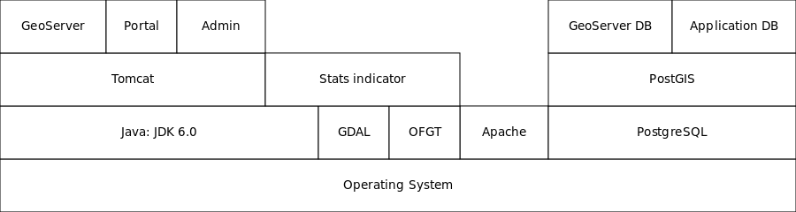
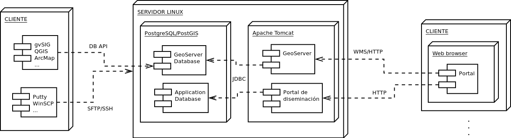

Arquitectura
==============

.. note::

	=================  ================================================
	Fecha              Autores
	=================  ================================================             
	24 Junio 2013		* Fernando González (fernando.gonzalez@fao.org)
	=================  ================================================	

	©2013 FAO Forestry 
	
	Excepto donde quede reflejado de otra manera, la presente documentación se halla bajo licencia : Creative Commons (Creative Commons - Attribution - Share Alike: http://creativecommons.org/licenses/by-sa/3.0/deed.es)

El sistema incluye una serie de tecnologías que se apoyan unas sobre las otras, siendo la base el sistema operativo y estando en la parte superior las aplicaciones desarrolladas para el portal del SNMB. Es posible observar en el siguiente diagrama que tanto los portales desarrollados como GeoServer hacen uso de Java. De la misma manera la utilidad para crear estadísticas está también desarrollada en Java pero hace uso a su vez de herramientas del sistema como GDAL y OFT. 

Cuando se realiza la instalación del sistema y éste se encuentra en funcionamiento, tenemos dentro de Tomcat una instancia de GeoServer y otra del portal, sobre el servidor de base de datos PostgreSQL/PostGIS tenemos dos bases de datos, una para almacenar los datos que sirve GeoServer y otra para los datos de la aplicación. 

En general, se conectará al sistema de las siguientes formas:

- A Tomcat con un navegador, via HTTP, para visualizar el portal.
- A Tomcat con un navegador, via HTTP, para administrar GeoServer y configurar los servicios OGC, mapas, etc.
- Al sistema operativo desde un cliente SFTP (como WinSCP) para descargar ficheros de configuración, editarlos en local y volverlos a subir al servidor. También para copiar datos que se quieran publicar (shapefiles).
- Al sistema operativo desde un cliente SSH (como PuTTY) para realizar otras tareas administrativas que requieran ejecución de comandos en el servidor: carga de datos en postgreSQL, copias de seguridad, etc.
- A la base de datos espacial desde un cliente GIS para visualizar y editar los datos.

