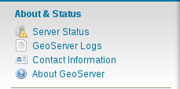
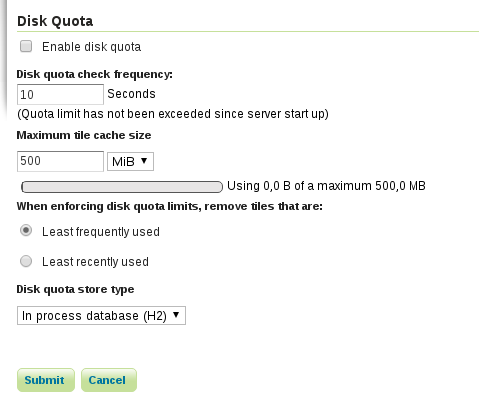

****************************************************************************
Puntos de la instalación a chequear, evaluación del estado de la instalación
****************************************************************************

Previo a la realización de la evaluación de la instalación del servidor, se recomienda revisar en la documentación
el punto `Checklist Rendimiento <http://snmb-admin.readthedocs.io/en/latest/performance_checklist.html?>`_ y revisar
los puntos de la lista para comprobar el estado de la instalación de GeoServer.

Java
====
Para obtener la versión de Java instalada en el servidor del visor será necesario ejecutar::

  $ java -version

desde la consola del servidor. la respuesta nos mostrará un mensaje semejante a este::

  java version "1.8.0_101"
  Java(TM) SE Runtime Environment (build 1.8.0_101-b13)
  Java HotSpot(TM) 64-Bit Server VM (build 25.101-b13, mixed mode)

donde podrán cambiar los números de las versiones.

Java ImageIO & JAI
==================

Java ImageIO y JAI son dos librerias de Java importantes a la hora del manejo de imágenes por GeoServer.
Para comprobar la instalación de dichas librerías, deberemos ir a la pestaña de *Server Status*:

y verificar que los valores *Native JAI* y *Native JAI* ImageIO están a *true*:

.. image:: _static/native.png
    :align: center

`Enlace a la documentación sobre el proceso de instalación de las librerías JAI. <http://snmb-admin.readthedocs.io/en/latest/geotalleres/geoserver-install/geoserver_install.html?highlight=imageio>`_

GeoServer
=========

Versión
-------
GeoServer se actualiza de versión bastante a menudo. Es recomendable tener el servidor actualizado a las últimas versiones, o por lo menos a la última versión LTS. Las versiones
LTS son aquellas sobre las que se tiene soporte de los desarrolladores durante un periodo más largo de tiempo que el que tardan en sacar una nueva versión.

Para revisar la versión de GeoServer accederemos al servidor desde nuestro cliente web y comprobaremos en la pantalla de bienvenida la versión del servidor.

.. warning::
    Solicitar información sobre el proceso de actualización de GeoServer a las versiones LTS en caso de necesitarlo.

GeoWebCache
===========
GeoWebCache (GWC) se encargará de crear las teselas de las capas más pesadas y almacenarlas en el disco duro, de manera estática, para evitar el procesamiento a la hora de mostrar
las imágenes y así poder realizar esto de una manera más fluida. La estrategia que se utiliza básicamente es seleccionar unos bounding box y unos niveles de zoom y pregenerar
las teselas correspondientes para esas zonas. Estas son almacenadas en el disco duro del servidor y será publicadas desde allí para las peticiones que correspondan. De manera
somera, es interesante el uso de GWC para capas que sean pesadas, no se actualicen los datos muy a menudo y en los niveles de zoom donde sean más utilizados.

Sobre la utilización de GeoWebCache existe en la documentación, `Pregeneración de teselas en GeoWebCache <http://snmb-admin.readthedocs.io/en/latest/geotalleres/geowebcache/pregeneracion.html>`_

Comprobar, si corresponde, el uso de GWC para las capas y la capacidad del servidor para guardar imágenes, así como la estrategía de la generación de estas teselas.

Para comprobar el estado del disco para GWC:

1. En el servidor GeoServer ir a la sección *Tile Caching* -> *Disk Quota*

2. Modificar los parametros de configuración adaptándolos a las necesidades especiales del portal

PostgreSQL & PostGIS
====================

Datos
=====

Vectorial
---------

Creación de índices
*******************

Los índices espaciales permiten a PostGIS realizar consultas espaciales de manera más efectiva, filtrando primero por los bounding box de las geometrías a aquellas que cumplen la
relación que se está comprobando y realizando la comprobación de la relación entre el resultado de este primer filtrado.

Para comprobar la existencia de índices espaciales en nuestras tablas, deberemos:

1. Conectarnos a nuestra base de datos con el cliente que utilicemos a menudo (las siguientes imágenes han sido obtenidas usando `pgAdmin3 <https://www.pgadmin.org/>`_)
2. Seleccionamos la tabla que deseamos inspeccionar:

.. image:: _static/table_pgadmin.png
    :align: center

3. Comprobamos en el panel *SQL Pane* la información de la tabla en SQL:

.. image:: _static/info_table.png
    :align: center

4. Comprobamos que existe el índice sobre la tabla verificando que aparece la sentencia de creación del índice * create index ... *:

.. image:: _static/info_table_index.png
    :align: center

A través de la consola utilizando el cliente *psql* también podremos obtener la información de las tablas. Para ello nos conectaremos al servidor de bases de datos
a través del cliente::

  $ psql -U nombre_usuario -d nombre_base_datos

una vez conectados a la base de datos inspeccionaremos las tablas espaciales para ver si tienen creados los índices::

  # \d+ nombre_tabla

a lo que obtendremos algo similar a esto:

donde se indica que la capa tiene definido el índice espacial::

  "zona_prioritaria_geom_idx" gist (geom)

`Mas información sobre índices espaciales <https://geotalleres.readthedocs.io/es/latest/postgis-indexacion-espacial/indexacion_espacial.html>`_

Raster
------
Existen variedad de casos y de procesos para la optimización de imágenes raster. Es importante revisar los datos para poder enfocar las mejores
optimizaciones para la particularidad de cada portal.

En la `lista de rendimiento <http://snmb-admin.readthedocs.io/en/latest/performance_checklist.html#datos-raster>`_ se pueden encontrar algunos de los casos comunes de problemas que aparecen
con los datos raster.

También es importante valorar si el dato es propenso a ser vectorizado o viceversa. En el caso de coberturas será más interesante presentar estos datos como raster, mientras que
para fenómenos aislados, puede ser interesante mostrar los datos en vectorial.

.. note::
  Solicite capacitación sobre optimización de la presentación de datos

Optimización y seguridad
========================

Minificación del código del portal
-----------------------------------

La parte del portal que se ejecuta en el navegador web está desarrollada en el lenguaje JavaScript. Este lenguaje se ejecuta en el navegador que estemos utilizando,
pero se descarga desde los servidores en los que tenemos publicados el portal. Cuanto menos ocupen los archivos, menos tiempo tardarán en descargarse y cuantos menos archivos tenga
que descargarse nuestro navegador menos tardará en poder cargar el portal en el cliente. Para ello existen diferentes estrategias, estando entre ellas la minificación de los ficheros
del portal y la concatenación de los ficheros de código en el mismo fichero (unificación).

Para comprobar si nuestro portal se encuentra optimizado:

1. Abrir el portal desde nuestro navegador web.
2. Activar las herramientas de desarrollo de nuestro navegador web (*Ctrl + Mayus + I* en Google Chrome)
3. En la pestaña de *Sources* (en Google Chrome), podremos observar los archivos que componen la aplicación:

Si nuestro portal se encuentra optimizado la estructura de carpetas será similar a la de la siguiente imagen:

donde encontraremos una carpeta *optimized* en la que se encuentran minificados y unificados todos los archivos de la aplicación.
En caso de no tener el portal optimizado, la estrucutra de carpetas será similar a la siguiente:

donde se podrán observar todos los archivos que componen la aplicación.

.. note::
  Para tener una versión optimizada del portal deberá empaquetar desde el código fuente de la aplicación utilizando la orden *mvn [install|package] -Poptimized* y
  luego configurar el arranque de Tomcat para que utilice la versión optimizada de los ficheros mediante el uso del parámetro *MINIFIED_JS=true*.

.. warning::
  Solicite capacitación sobre desarrollo y puesta en producción.

Monitorización
==============
La monitorización nos permitirá tener un seguimiento instantaneo del estado de nuestros servicios, así como de su rendimiento. Es interesante de cara a mantener el mejor
servicio posible de nuestros recursos, que estos sean monitorizados en todo momento y que permita detectar posibles caidas o bajadas de rendimiento y que podamos actuar
rápidamente para subsanarlos evitando así un mal servicio a nuestros usuarios.

Existen infinidad de herramientas para realizar la monitorización de servicios. `Monit <https://mmonit.com/monit/>`_ es una herramienta sencilla en su configuración y uso,
que nos permitirá realizar una monitorización de nuestros servicios.

Asimismo GeoServer dispone de `herramientas de monitorización <http://docs.geoserver.org/2.8.3/user/extensions/monitoring/configuration.html>`_ que nos ayudarán en esta labor.

Comprobar que se están realizando las tareas de monitorización de nuestros servicios.

.. note::
  Solicitar capacitación sobre monitorización de servicios.

Backups
=======
En la instalación del portal existen tres partes sobre las que deberemos realizar copias de seguridad:

1. PostgreSQL/PostGIS
2. GeoServer
3. Portal

.. warning::
  Las copias de seguridad de las diferentes partes de la instalación son de **VITAL** importancia. Cualquier problema en los servidores ocasionaría la perdida
  de los datos en la base de datos o en el servidor de mapas u ocasionaría la perdida de la configuración del portal.

Creación de copias de seguridad en PostgreSQL
---------------------------------------------
Con las copias de seguridad en PostgreSQL podremos mantener seguros los datos que se encuentran almacenados en la base de datos. Mediante los mecanismos de los que disponemos
en PostgreSQL podremos restaurar la información en caso de perdida de los datos.

Comprobar que se están realizando de manera correcta las copías de seguridad.

.. note::
  Documentación sobre realización de `copias de seguridad para PostgreSQL <http://snmb-admin.readthedocs.io/en/latest/geotalleres/postgresql/postgresql.html#postgresql-backup>`_

Creación de copias de seguridad en GeoServer
---------------------------------------------
Mediante las copias de seguridad del directorio de datos de GeoServer podremos mantener segura la configuración de nuestro servidor de mapas.

Comprobar que se están realizando correctamente las copias de seguridad de GeoServer

.. note::
  Documentación sobre realización de `copias de seguridad para GeoServer <http://snmb-admin.readthedocs.io/en/latest/geotalleres/geoserver-backup/geoserver_backup.html#geoserver-backup>`_

Creación de copias de seguridad para el portal
----------------------------------------------
Para mantener seguro nuestro portal simplemente deberemos realizar copias de seguridad de la carpeta donde se encuentran los ficheros que configuran nuestro portal. La
funcionalidad del mismo se encuentra en un archivo que podremos generar cuantas veces queramos a partir del código fuente.

Comprobar que se están ejecutando de manera correcta las copias de seguridad del portal.

.. note::
  Documentación sobre realización de `copias de seguridad para el Portal <http://snmb-admin.readthedocs.io/en/latest/backups.html#portal>`_
