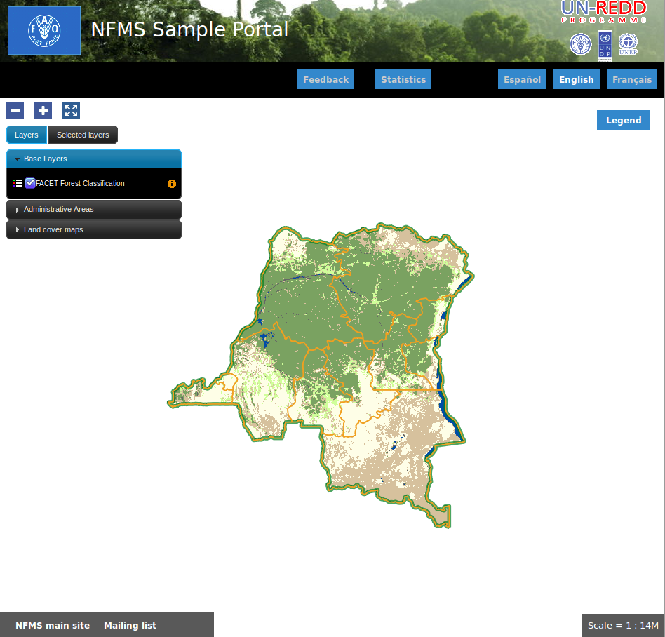

.. _portal_configuration:

Portal: Configuración inicial 
======================================

.. note::

	=================  ================================================
	Fecha              Autores
	=================  ================================================ 
	1 Noviembre 2012    * Stefano Giaccio (Stefano.Giaccio@fao.org)
	1 Diciembre 2012    * Oscar Fonts (oscar.fonts@geomati.co)
	24 Junio 2013		* Fernando González (fernando.gonzalez@fao.org)
	=================  ================================================	

	©2013 FAO Forestry 
	
	Excepto donde quede reflejado de otra manera, la presente documentación se halla bajo licencia : Creative Commons (Creative Commons - Attribution - Share Alike: http://creativecommons.org/licenses/by-sa/3.0/deed.es)

El Portal de NFMS es la aplicación pública de la plataforma, utilizada para la visualización de los recursos cartográficos y estadísticos.

El portal es personalizable a las necesidades de cada país, tanto en su aspecto como en los datos mostrados. La aplicación viene con una 
configuración por defecto que puede usarse como punto de partida.

En nuestro caso, una vez instalado el portal se obtendrá el siguiente aspecto inicial:

El Portal es accesible en:

  http://localhost/portal/

El directorio de configuración
------------------------------

El directorio de configuración (:file:`/var/portal`) tiene la siguiente estructura::

	  /var/portal
	    |- portal.properties
	    |- layers.json
	    |- messages/
	    |- modules/
	    \- static/
	        |- overrides.css
	        |- img/
	        \- loc/
	            |- en/
	            │   |- documents/
	            │   |- html/
	            │   \- images/
	            \- es
	                |- documents/
	                |- html/
	                \- images/

Los ficheros principales son:

 * ``portal.properties``, contiene parámetros generales del portal, como por ejemplo los idiomas soportados.
 * ``layers.json``, probablemente el fichero más importante, contiene la configuración de las capas de datos a mostrar.
 * ``messages/`` contiene los textos de la aplicación traducidos a varios idiomas.
 * ``modules/`` permite añadir modulos Javascript a la aplicación.
 * ``static/`` contiene recursos estáticos. 
 * ``static/loc``: recursos clasificados por idioma
 * ``static/overrides.css``: última hoja CSS cargada, ideal para sobreescribir otros estilos

.. _portal_properties_configuration:

portal.properties
------------------

* languages = {"en": "English", "fr": "Fran\u00e7ais", "es": "Espa\u00f1ol"}

  Elemento JSON con los idiomas que soporta la aplicación
  
* languages.default = en

  Idioma por defecto.

* highlight-bounds=true

  Si cuando se pide información sobre un objeto, al pasar el ratón sobre la tabla de atributos se resalta sólo el encuadre (bounds) del objeto y no el contorno. 

* db-schema=portal_redd

  Nombre del esquema donde están las tablas necesarias para las distintas funcionalidades como estadísticas y feedback
  
* layers.rootFolder=/tmp

  Raíz de la configuración de estadísticas (experimental)
  
* info.layerUrl=http://demo1.geo-solutions.it/diss_geoserver/gwc/service/wms

  URL de las capas ``queryable``

* info.queryUrl=http://demo1.geo-solutions.it/diss_geoserver/wms
  
  URL de las capas ``queryable`` contra la que hacer la petición GetFeatureInfo

* map.centerLonLat=24, -4

  Longitud y latitud del centro inicial del mapa
  
* map.initialZoomLevel=5

  Nivel de zoom inicial

layers.json
------------

Define la estructura de capas del proyecto. Consiste en un elemento JSON con tres propiedades::

	{
		"wmsLayers" : [],
	
		"portalLayers" : [],
	
		"groups" : []
	}

* ``wmsLayers`` define las capas WMS que tendrá el mapa. El orden en el que estas capas aparecen en el array ``wmsLayers`` define el orden de las capas en el dibujado del mapa. Cada capa consistirá en un elemento que puede ser de tres tipos. El tipo por defecto es WMS y tiene las siguientes propiedades:

	* id: Identificado de la capa
	* type: Tipo de la capa: WMS, Open Street Map, Google maps, respectivamente "wms", "osm" o "gmaps". Por defecto se tomará type:"wms"
	* visible: Si la capa es utilizada para visualizarse en el mapa o sólo para otras cosas (petición de información, por ejemplo).
	* zIndex: Posición en la pila de dibujado
	* legend: Nombre del fichero imagen con la leyenda de la capa. Estos ficheros se acceden en static/loc/{lang}/images
	* label: Título de la leyenda
	* sourceLink: URL del proveedor de los datos
	* sourceLabel: Texto con el que presentar el enlace especificado en sourceLink

	En función del tipo de la capa se especificarán además otras propiedades
	
  * WMS:
	
	* baseUrl: URL del servidor WMS que sirve la capa
	* wmsName: Nombre de la capa en el servicio WMS
	* imageFormat: Formato de imagen a utilizar en las llamadas WMS
	* queryable: Si se pretende ofrecer herramienta de información para la capa o no. La herramienta de información sólo tiene en cuenta la instancia temporal general, no la específica de la capa que puede darse cuando se instala el plugin ``layer-time-sliders``. Esto sólo puede darse cuando se activa esta opción para capas con varias instancias temporales por lo que se recomienda evitar esta situación.
	    
	Por ejemplo:
		
	.. code-block:: javascript
			
		{
			"wmsLayers" : [
				{
					"id" : "provinces",
					"baseUrl" : "http://demo1.geo-solutions.it/diss_geoserver/wms",
					"wmsName" : "unredd:drc_provinces",
					"imageFormat" : "image/png8",
					"visible" : true,
					"sourceLink" : "http://www.wri.org/publication/interactive-forest-atlas-democratic-republic-of-congo",
					"sourceLabel" : "WRI",
					"queryable" : true
				}
			],
			...
		}

  * Open Street Map:
    
	* osmUrls: lista de las URL de los tiles. Usando ${x}, ${y} y ${z} como variables.
    
	Por ejemplo:
 		
    .. code-block:: javascript

		{
			"wmsLayers" : [
				{
					"id" : "openstreetmap",
					"type" : "osm",
					"osmUrls" : [
						"http://a.tile.openstreetmap.org/${z}/${x}/${y}.png",
						"http://b.tile.openstreetmap.org/${z}/${x}/${y}.png",
						"http://c.tile.openstreetmap.org/${z}/${x}/${y}.png"
					]
				}			
			],
			...
		}
    
  * Google:
    
	* gmaps-type: Tipo de capa Google: ROADMAP, SATELLITE, HYBRID o TERRAIN
      
	Por ejemplo:
	
    .. code-block:: javascript
      
		{
			"wmsLayers" : [
				{
					"id" : "google-maps",
					"type" : "gmaps",
					"gmaps-type" : "SATELLITE"
				}
			],
			...
		}
	

* ``portalLayers`` define las capas que aparecen visibles al usuario. Una ``portalLayer`` puede contener varias ``wmsLayers``. Cada ``portalLayer`` puede contener los siguientes elementos:

	* id: id de la capa
	* label: Texto con el nombre de la capa a usar en el portal. Si se especifica entre ${ }, se intentará obtener la traducción de los ficheros .properties existentes en el directorio ``messages`` del  directorio de configuración del portal.
	* infoFile: Nombre del fichero HTML con información sobre la capa. El fichero se accede en static/loc/{lang}/html. En la interfaz gráfica se representa con un botón de información al lado del nombre de la capa 
	* inlineLegendUrl: URL con una imagen pequeña que situar al lado del nombre de la capa en el árbol de capas
	* active: Si la capa está inicialmente visible o no
	* layers: Array con los identificadores de las ``wmsLayers`` a las que se accede a través de esta capa
	* timeInstances: Instantes de tiempo en ISO8601 separados por comas
	* date-format: Formato de la fecha para cada capa. Según la librería Moment (http://momentjs.com/docs/#/displaying/). Por ejempo: "DD-MM-YYYY". Por defecto sólo el año (YYYY).
	* feedback: En el caso de que la herramienta de feedback esté instalada, si se quiere o no que la capa aparezca en dicha herramienta para permitir al usuario hacer comentarios sobre la capa.  
	
	Por ejemplo::
		
		{
			"wmsLayers" : [
				{
					"id" : "wms_provinces",
					"baseUrl" : "http://demo1.geo-solutions.it/diss_geoserver/wms",
					"wmsName" : "unredd:drc_provinces",
					"imageFormat" : "image/png8",
					"visible" : true,
					"sourceLink" : "http://www.wri.org/publication/interactive-forest-atlas-democratic-republic-of-congo",
					"sourceLabel" : "WRI",
					"queryable" : true
				}
			],
			"portalLayers" : [
				{
					"id" : "provinces",
					"active" : true,
					"infoFile" : "provinces_def.html",
					"label" : "${provinces}",
					"layers" : [ "wms_provinces" ],
					"inlineLegendUrl" : "http://demo1.geo-solutions.it/diss_geoserver/wms?REQUEST=GetLegendGraphic&VERSION=1.0.0&FORMAT=image/png&WIDTH=20&HEIGHT=20&LAYER=unredd:drc_provinces&TRANSPARENT=true",
					"timeInstances" : "2007-03-01T00:00,2008-05-11T00:00,2005-03-01T00:00",
					"date-format" : "DD-MM-YYYY"
				}
			],
			...
		}
	
* ``groups`` define la estructura final de las capas en el árbol de capas de la aplicación. Cada elemento de ``groups`` contiene:

	* id: id del grupo
	* label: Igual que en ``portalLayer``
	* infoFile: Igual que en ``portalLayer``
	* items. Array de otros grupos, con la misma estructura que este elemento (recursivo).
	
	Por ejemplo::
		
		{
			"wmsLayers" : [
				{
					"id" : "wms_provinces",
					"baseUrl" : "http://demo1.geo-solutions.it/diss_geoserver/wms",
					"wmsName" : "unredd:drc_provinces",
					"imageFormat" : "image/png8",
					"visible" : true,
					"sourceLink" : "http://www.wri.org/publication/interactive-forest-atlas-democratic-republic-of-congo",
					"sourceLabel" : "WRI",
					"queryable" : true,
					"wmsTime" : "2007-03-01T00:00,2008-05-11T00:00,2005-03-01T00:00"
				}
			],
			"portalLayers" : [
				{
					"id" : "provinces",
					"active" : true,
					"infoFile" : "provinces_def.html",
					"label" : "${provinces}",
					"layers" : [ "wms_provinces" ],
					"inlineLegendUrl" : "http://demo1.geo-solutions.it/diss_geoserver/wms?REQUEST=GetLegendGraphic&VERSION=1.0.0&FORMAT=image/png&WIDTH=20&HEIGHT=20&LAYER=unredd:drc_provinces&TRANSPARENT=true"
				}
			],
			"groups" : [
				{
					"id" : "base",
					"label" : "${base_layers}",
					"infoFile": "base_layers.html",
					"items" : ["provinces"]
				}
			]
		}

Adaptación del aspecto gráfico
------------------------------

Cabecera y pie de página
........................

Los elementos de la cabecera están descritos en ``header.tpl``, en formato HTML:

.. code-block:: html

	

	    

	    

	    ${title}
	

En este fichero podemos ver tres elementos con identificador (atributo ``id``) ``flag``, ``logos`` y ``title`` que se corresponden a la bandera, título y logo de la derecha, señalados en rojo, azul y amarillo en la siguiente imagen:

.. image :: _static/header.png

El atributo ``id`` será utilizado desde la hoja de estilos ``unredd.css``, donde se asociará una imagen y otros parámetros de visualización. Como ejercicio:

* Abrir el fichero ``custom.css``, buscar los elementos "logos" y "flag" y cambiar la imagen.

Nótese que también dicho fichero especifica la imagen de fondo del banner completo, con id ``banner``. Como ejercicio:

* Abrir el fichero ``custom.css``, buscar el element "banner" y cambiar la imagen.

.. note:: `Tutorial de CSS <http://www.csstutorial.net/>`_

En caso de tener que añadir más de un logo, es posible eliminar la imagen de fondo del elemento ``logos`` y añadir dentro de dicho elemento un elemento por cada logo que se quiera añadir. Estos elementos pueden ser hyperenlaces ``<a>`` y llevar al usuario a la página del propietario del logo.

La plantilla para el pie de página ``footer.tpl`` funciona de forma similar y ofrece un elemento con id ``footer_links`` en el que se puede poner todos los hiperenlaces que se quieran:

.. code-block:: html

	

	    <a id="notice_download" href="http://nfms4redd.org" target="_blank">${information_note}</a>
	    <a id="user-group" href="http://groups.google.com/group/nfms4redd-users" target="_blank">Mailing list</a>
	

* Ejercicio: Añadir un enlace a http://www.un-redd.org/ con el texto ``Programa ONU-REDD``

Para aplicar los cambios, hace falta reiniciar de nuevo la aplicación::

	$ sudo service tomcat6 restart

*Favicon*
.........

Se conoce como *favicon* al icono que se muestra en el navegador en la barra de direcciones. Para personalizar el *favicon*
del portal, basta con copiar la imagen en el directorio ``static/img``. El nombre de la imagen sólo puede ser ``favicon.ico`` o ``favicon.png``.

.. image :: _static/favicon.png
	:align: center

Estilos predefinidos (CSS)
..........................

En ciertos casos se requiere modificar los estilos que vienen predefinidos para OpenLayers, jQuery o cualquier otro. En estos casos,
en lugar de modificar los estilos directamente en el fichero que se encuentra en ``/var/tomcat/webapps/portal``, se ha de crear
un nuevo fichero ``overrides.css`` en el directorio ``/var/portal/static/css`` que contenga las reglas CSS que se desean modificar.

De esta manera, tendrán preferencia las reglas que se escriban en ``overrides.css`` frente a cualquier otra que se encuentre en
``/var/tomcat/webapps/portal``.

Además, cuando se despliegue una actualización del portal en Tomcat, el fichero ``overrides.css`` no se modificará, manteniendo
así la personalización.

Soporte multiidioma
-------------------

En los casos anteriores vemos algunas cadenas de texto entre los símbolos ``${`` y ``}``. Estos elementos son sustituidos por mensajes de texto traducidos a cada idioma.

En el directorio ``messages`` contamos con un fichero ``messages.properties`` que contiene los mensajes por defecto. Son los textos que se usarán en caso de no encontrar mensajes traducidos a una lengua específica. Los ficheros para los distintos idiomas soportados llevan el código del idioma al final del nombre, según la `nomenclatura ISO 639-1 de dos letras <http://en.wikipedia.org/wiki/List_of_ISO_639-1_codes>`_.

Como ejercicio:

  * Buscar el elemento `title` en ``messages_es.properties``.

Otro ejercicio:

  * Traducir el texto del enlace añadido en ``footer.tpl``

De la misma manera, Para añadir un nuevo idioma (por ejemplo, el guaraní):

 * Editar ``portal.properties`` y añadir el elemento ``"gn": "Guaraní"`` a la propiedad ``languages``::

    languages = {"gn": "Guaraní", "es": "Español", "en": "English"}

 * Copiar el fichero ``messages_es.properties`` con el nuevo nombre ``messages_gn.properties``.
 * Traducir los textos en ``messages_gn.properties``.
 * Reiniciar la aplicación para aplicar los cambios. Desde la linea de comandos::

	sudo service tomcat6 restart

Configuración de una nueva capa
-------------------------------

La definición de las capas a mostrar en el Portal se encuentra en el fichero ``layers.json``.

Contiene la información para asociar los elementos de la interfaz de usuario (panel con la lista de capas en la parte izquierda de la página)
con las capas WMS publicadas en GeoServer, personalizar las leyendas, y definir cuáles de las capas son interrogables. También clasifica las capas
por grupos.

El formato utilizado para este fichero de configuración es JSON (JavaScript Object Notation), que es un formato para la representación de datos. Está fuera del objetivo de esta guía el aprendizaje de JSON, pero se exponen a continuación algunas nociones básicas:

* Los valores en JSON pueden ser: números, cadenas de carácteres, booleanos, arrays, objetos y el valor nulo. Por ejemplo: 13, "hola mundo", true, [12, 5, 2], {"id":3}.

* Los objetos están delimitados por llaves (``{}``) y contienen una serie de pares atributo-valor separados por comas. Los pares atributo/valor consisten en un nombre de propiedad entrecomillado, dos puntos y el valor. Por ejemplo podemos tener el siguiente elemento:

  .. code-block:: js

	{
		"id":12,
		"nombre":"paco",
		"edad":55
	}

  o incluso un elemento dentro de otro:
  
  .. code-block:: js

	{
		"empresa":"zapatos smith",
		"propietario":{
			"id":12,
			"nombre":"john smith",
			"edad":55
		},
		"pais":"Argentina"
	}
  

* Los arrays especifican sus valores entre corchetes ([]) y separados por comas.

  .. code-block:: js

	[1, 2, 3, 4, 5]
	
  .. code-block:: js

	[
		{
			"id":12,
			"nombre":"john smith",
			"edad":34
		},
		{
			"id":12,
			"nombre":"sarah smith",
			"edad":22
		},
		{
			"id":12,
			"nombre":"Clark Kent",
			"edad":43
		}
	]

.. note:: Recursos JSON

  * `Introducción al formato JSON <http://www.json.org/>`_
  * `Validador de JSON <http://jsonformatter.curiousconcept.com/>`_
  * Validador en línea de comandos: python -mjson.tool <fichero.json>

El fichero ``layers.json`` contiene tres secciones:

* ``wmsLayers``
* ``portalLayers``
* ``groups``

En este apartado vamos a realizar dos ejercicios:

* En primer lugar, vamos a añadir la capa de límites administrativos al grupo existente de "admin_areas".

* En segundo lugar, añadiremos la capa "roads" en un nuevo grupo de capas.

Conexión WMS
............

Cada "wmsLayer" se corresponde con una de las capas publicadas en GeoServer, y describe la manera de conectarse al servidor para obtener los datos:

TODO link the reference and complete the reference if necessary

.. code-block:: js

  "wmsLayers": [
     {
      "id": "limites_administrativos",
      "baseUrl": "http://172.16.250.131/geoserver/gwc/service/wms",
      "wmsName": "capacitacion:limites_administrativos",
      "imageFormat": "image/png",
      "visible": true
    }
  ],

* Es posible copiar y pegar un elemento existente y reemplazar :

  * el nuevo "id" será distinto a todos los otros, por ejemplo: "limites_administrativos".
  * el nuevo "wmsName" será "capacitacion:limites_administrativos" (el nombre de la capa publicada en GeoServer).
  * la baseUrl debe apuntar al servidor geoserver donde hemos cargado la capa.

Capas del portal
.................

Cada "portalLayer" representa una capa en el árbol de capas del portal y por tanto añade nuevos datos necesarios para mostrar la información en la interfaz gráfica.

.. code-block:: js

  "portalLayers": [
    {
      "id": "limites_administrativos",
      "active": true,
      "label": "${limites_administrativos}",
      "infoFile": "limites_def.html",
      "layers": ["country"],
      "inlineLegendUrl": "http://172.16.250.131/geoserver/wms?REQUEST=GetLegendGraphic&VERSION=1.0.0&FORMAT=image/png&WIDTH=20&HEIGHT=20&LAYER=unredd:country&TRANSPARENT=true"
    }
  ],

* Añadir un nuevo objeto en "context", de igual estructura y valores que "country", excepto los siguientes cambios:

  * el nuevo "id" será "regions".
  * como "label" se utilizará "${limites_administrativos}". De nuevo, esta etiqueta de sintaxis ${...} será sustituida por un texto en el idioma que
    corresponda, según los contenidos de "messages". Es la etiqueta que se mostrará en la interfaz gráfica.
  * en "infoFile" pondremos "administrative_boundaries_def.html". Esto creará un enlace a un documento con información sobre 
    los datos (localizado en :file:`static/loc/<idioma>/html/`).
  * en "layers" pondremos ["limites_administrativos"], haciendo referencia al nuevo *layer*.
  * en "inlineLegendUrl" estableceremos el parámetro LAYER así `LAYER=capacitacion:limites_administrativos`. Esto generará
    una imagen con la leyenda. 

Grupos
.............

Los "Groups" son una estructura recursiva (multinivel) para agrupar visualmente las capas en el panel.
El "group" de primer nivel construye cada uno de los grupos de capas en forma de persiana desplegable, conteniendo una lista de 
"items" que hacen referencia a los contextos definidos anteriormente.

.. code-block:: js

	"groups" : [
		{
			"id" : "admin",
			"label" : "${admin_areas}",
			"items" : [ "countryBoundaries", "provinces" ]
		}, 
		...
	]

Nótese que en la propiedad "items", se hace referencia a las "portalLayers" definidas anteriormente. También, es posible dentro de dicha propiedad, añadir varios subgrupos de manera que las capas contenidas en éstos se visualicen dentro de una misma pestaña, pero agrupados visualmente bajo un título.

.. code-block:: js

	"groups" : [
		{
			"id" : "admin",
			"label" : "${admin_areas}",
			"items" : [
				{
					"id" : "admin1",
					"label" : "Nacional",
					"items": ["limite_nacional"]
				}, {
					"id" : "admin2",
					"label" : "Regional",
					"items": [ "provincias" ]
				}
			]
		}, 
		...
	]

* Añadir un nuevo elemento `{ "context": "limites_administrativos" }` a continuación de `{ "context": "country" }`. Esto incluirá la capa
  en el grupo de áreas administrativas.
  
* Finalmente, utilizar un validador JSON, para comprobar que la sintaxis del nuevo :file:`layers.json` es correcta, y recargar la página.

Posición inicial del mapa y prefijo capas
------------------------------------------

Antes de añadir la capa de carreteras vamos a proceder a configurar la posición inicial del mapa. Para ello tenemos que editar el fichero
``static/custom.js`` y que contiene al principio del todo una declaración con los valores que nos interesa cambiar::

	UNREDD.maxExtent = new OpenLayers.Bounds(-20037508, -20037508, 20037508, 20037508);
	UNREDD.restrictedExtent = new OpenLayers.Bounds(-20037508, -20037508, 20037508, 20037508);
	UNREDD.maxResolution = 4891.969809375;
	UNREDD.mapCenter = new OpenLayers.LonLat(-9334782,-101119);
	UNREDD.defaultZoomLevel = 0;
	
	UNREDD.wmsServers = [
	    "http://demo1.geo-solutions.it",
	    "http://incuweb84-33-51-16.serverclienti.com"
	];
	
Para la posición central del mapa tendremos que modificar el valor *UNREDD.mapCenter* y poner la coordenada central en Google 
Mercator (EPSG:900913 o EPSG:3857), que es el sistema de referencia que se usa en la aplicación web.

  * Obtener la coordenada central del mapa en el sistema de coordenadas usado en el portal.

Para regular el nivel de zoom inicial es posible cambiar el valor *UNREDD.defaultZoomLevel*. Cuanto mayor es el nivel de
zoom, más cercano es el zoom inicial.

Por último, es posible configurar en ``UNREDD.wmsServers`` una o más URLs correspondientes a nuestro servidor de manera que en el fichero ``layers.json`` basete especificar los atributos *baseUrl* con URLs relativas comenzando por el carácter "/". Estas URLs se componen prefijando los servidores especificados en el valor *UNREDD.wmsServers*. Por otra parte, si el servidor tiene más de una dirección, es conveniente especificarlas todas, ya que algunos navegadores limitan la cantidad de peticiones que se pueden hacer simultáneamente a un servidor y éste sería un método para sobrepasar ese límite.

Ejercicio:

  * Poner el servidor local en *UNREDD.wmsServers* y poner todas las capas del servidor como relativas.

Configuración de un nuevo grupo de capas
----------------------------------------

Repetiremos el ejercicio anterior para añadir la capa de ciudades, teniendo en cuenta que:

* Para el nuevo "layer", usaremos el id "ciudades" y la capa wms "capacitacion:ciudades". Además, añadiremos un nuevo
  atributo `"legend": "ciudades.png"` para mostrar la leyenda de la capa. Este atributo hace referencia a una imagen
  localizada en :file:`static/loc/<idioma>/images/`.
  
* En el nuevo "context", será más sencillo, sólo contendrá los tres elementos `"id": "roads", "label": "${ciudades}", "layers": ["ciudades"]`.

* En "contextGroups", crearemos un nuevo grupo llamado "otros", con esta sintaxis:

.. code-block:: js

  {
    "group": {
      "label": "${other}",
      "items": [
          { "context": "roads" }
      ]
  }

* Tras validar el JSON, y recargar la página, obtendremos la capa de carreteras bajo el nuevo grupo "Otros".
