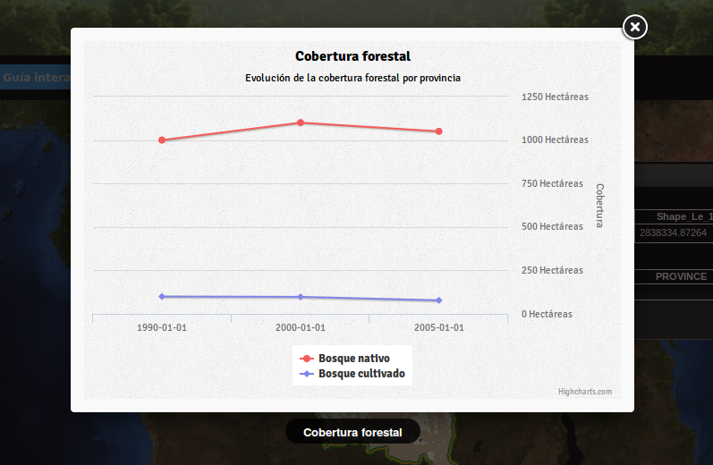

Estadísticas
=========================

El sistema de estadísticas consta de dos partes. Por una parte, el servicio de estadísticas nos permite mostrar al usuario gráficas sobre objetos existentes en el mapa. Por otra, el motor de cálculo nos permite generar los datos estadísticos de cobertura de forma automática.

Servicio de estadísticas
------------------------------

Este servicio nos permitirá obtener gráficos sobre objetos del mapa. Los datos a presentar en dichos gráficos pueden presentar una o más variables con datos en uno o más instantes temporales.

Para ello es necesario configurar dos tablas en la base de datos:

* Metadatos: tabla con la información sobre el gráfico: título, unidades, tipo de gráfico, nombre de la tabla de datos
* Datos: tabla con las magnitudes a presentar para cada serie en el gráfico

Instalación
...............

Para que el servicio de estadísticas funcione es necesario:

#. Crear un esquema en la base de datos. En dicho esquema se introducirán todas las tablas usadas por el portal tanto para estadísticas como para otras funcionalidades.
#. Crear la tabla de metadatos:

   .. code-block:: sql

	CREATE TABLE mi_esquema.redd_stats_metadata (
		id serial NOT NULL,
		title character varying,
		subtitle character varying,
		description character varying,
		y_label character varying,
		units character varying,
		tooltipsdecimals integer,
		layer_name character varying,
		table_name_division character varying,
		division_field_id character varying,
		class_table_name character varying,
		class_field_name character varying,
		date_field_name character varying,
		table_name_data character varying,
		graphic_type character varying,
		CONSTRAINT indicators_metadata_pkey PRIMARY KEY (id)
	) WITH ( OIDS=FALSE )
 
#. Configurar el esquema en el ``portal.properties`` existente en el directorio de configuración del portal::

	db-schema=mi_esquema

#. Tras este último paso es necesario reinicializar el portal. Esto se puede realizar mediante el comando ``touch`` aplicado al war. Este comando modifica la fecha y hora del fichero que se le pasa como parámetro, lo que fuerza a Tomcat a redesplegar el war y reinicializar la aplicación::

	$ touch /var/tomcat/webapps/portal.war

Configuración de la tabla de metadatos
...........................................

Cada fila de la tabla de metadatos especificará un gráfico para los objetos de una capa del portal. No todos los campos son necesarios, sólo serán necesarios:

- id: identificador, rellenado automáticamente.
- title: título del gráfico como se mostrará en el portal
- subtitle: subtítulo del gráfico como se mostrará en el portal
- description: descripción del gráfico, actualmente sin uso
- y_label: nombre de la magnitud medida para cada serie, por ejemplo "superficie"
- units: unidades en las que se mide la magnitud, por ejemplo "Hectáreas"
- tooltipsdecimals: Número de decimales que se presentarán cuando el usuario interactúa con la gráfica
- layer_name: Nombre en GeoServer de la capa para la que se presentarán las estadísticas, con la forma espaciodetrabajo:nombrecapa. Por ejemplo: bosques:provincias
- division_field_id: Nombre del campo que identifica los objetos en la capa anterior. Es posible utilizar un campo que no es único si se desea tener el mismo gráfico para más de un objeto.
- table_name_data: Nombre de la tabla que contiene los datos a presentar.
- graphic_type: Tipo de gráfico. Puede ser 2D o 3D.

Configuración de la tabla de datos
......................................

Cada registro de la tabla de metadatos requiere una tabla con los datos de los gráficos que se llame como se especificó en el campo ``table_name_data`` de dicho registro.

Esta tabla presenta datos de una o más variables en uno o más instantes temporales. Para cada dato se creará un registro con los campos siguientes:

- division_id: Valor del campo ``division_field_id`` del registro de la tabla de metadatos que hace referencia a esta tabla.
- variable: Nombre de la variable a presentar, por ejemplo ``bosque nativo``.
- valor: Magnitud presentada en el gráfico para la ``variable`` en el instante ``fecha``. 
- fecha: Fecha en la cual se da el ``valor`` de la ``variable``.

Para la creación se puede utilizar la siguiente plantilla:

.. code-block:: sql

	CREATE TABLE <esquema>.<nombre> (
		division_id varchar,
		variable varchar,
		valor real,
		fecha date
	);

Caso práctico
...............

En este ejemplo vamos a suponer que tenemos:

* Una tabla provincias con un campo ``id_provincia`` con tres provincias con identificador 1, 2 y 3.
* Una capa en GeoServer, publicando la tabla anterior con el nombre ``provincias`` en el espacio de trabajo ``bosques``, es decir, con nombre ``bosques:provincias``.
* La tabla convenientemente publicada en el portal, de manera es es posible mostrar el diálogo de información al pinchar en una de las provincias.

Es posible descargar los datos de ejemplo `aquí <_static/statistics/provincias.zip>`_, para su carga en PostGIS y la realización del caso práctico con ellos.

Queremos publicar los siguientes datos de cobertura forestal:

=================  ====== ====== ======
Provincia 1         1990   2000   2005 
=================  ====== ====== ======
bosque nativo        100     98     78 
bosque cultivado    1000   1100   1050 
=================  ====== ====== ======

=================  ====== ====== ======
Provincia 2         1990   2000   2005 
=================  ====== ====== ======
bosque nativo        590     ND    208 
bosque cultivado       0      0     50 
=================  ====== ====== ======

=================  ====== ====== ======
Provincia 3         1990   2000   2005 
=================  ====== ====== ======
bosque nativo       2000   2300   2500 
bosque cultivado       0    100     50 
=================  ====== ====== ======

Lo primero será crear la tabla de datos con cualquer nombre significativo, por ejemplo ``cobertura_forestal_provincias``. Suponemos que creamos todo en un esquema llamado estadísticas:

.. code-block:: sql

	CREATE TABLE estadisticas.cobertura_forestal_provincias(
		division_id varchar,
		variable varchar,
		valor real,
		fecha date
	);

Una vez la tabla está creada, es necesario introducir un registro por cada dato:

.. code-block:: sql

	INSERT INTO estadisticas.cobertura_forestal_provincias VALUES ('1', 'bosque nativo', 100, '1/1/1990');
	INSERT INTO estadisticas.cobertura_forestal_provincias VALUES ('1', 'bosque nativo', 98, '1/1/2000');
	INSERT INTO estadisticas.cobertura_forestal_provincias VALUES ('1', 'bosque nativo', 78, '1/1/2005');
	INSERT INTO estadisticas.cobertura_forestal_provincias VALUES ('1', 'bosque cultivado', 1000, '1/1/1990');
	INSERT INTO estadisticas.cobertura_forestal_provincias VALUES ('1', 'bosque cultivado', 1100, '1/1/2000');
	INSERT INTO estadisticas.cobertura_forestal_provincias VALUES ('1', 'bosque cultivado', 1050, '1/1/2005');

	INSERT INTO estadisticas.cobertura_forestal_provincias VALUES ('2', 'bosque nativo', 590, '1/1/1990');
	-- Dato no disponible para 2000
	INSERT INTO estadisticas.cobertura_forestal_provincias VALUES ('2', 'bosque nativo', 208, '1/1/2005');
	INSERT INTO estadisticas.cobertura_forestal_provincias VALUES ('2', 'bosque cultivado', 0, '1/1/1990');
	INSERT INTO estadisticas.cobertura_forestal_provincias VALUES ('2', 'bosque cultivado', 0, '1/1/2000');
	INSERT INTO estadisticas.cobertura_forestal_provincias VALUES ('2', 'bosque cultivado', 50, '1/1/2005');

	INSERT INTO estadisticas.cobertura_forestal_provincias VALUES ('3', 'bosque nativo', 2000, '1/1/1990');
	INSERT INTO estadisticas.cobertura_forestal_provincias VALUES ('3', 'bosque nativo', 2300, '1/1/2000');
	INSERT INTO estadisticas.cobertura_forestal_provincias VALUES ('3', 'bosque nativo', 2500, '1/1/2005');
	INSERT INTO estadisticas.cobertura_forestal_provincias VALUES ('3', 'bosque cultivado', 0, '1/1/1990');
	INSERT INTO estadisticas.cobertura_forestal_provincias VALUES ('3', 'bosque cultivado', 100, '1/1/2000');
	INSERT INTO estadisticas.cobertura_forestal_provincias VALUES ('3', 'bosque cultivado', 50, '1/1/2005');

Por último crearemos el registro en la tabla de metadatos que enlaza estos datos con nuestra tabla de datos recién creada:

.. code-block:: sql

	INSERT INTO estadisticas.redd_stats_metadata (
		title,
		subtitle,
		y_label,
		units,
		tooltipsdecimals,
		layer_name,
		division_field_id,
		table_name_data,
		graphic_type
	) VALUES (
		'Cobertura forestal',
		'Evolución de la cobertura forestal por provincia',
		'Cobertura',
		'Hectáreas',
		2,
		'bosques:provincias',
		'id_provinc',
		'estadisticas.cobertura_forestal_provincias',
		'2D'
	);

Ahora, cuando el usuario pinche en una de las provincias:

#. el portal buscará en la tabla ``estadisticas.redd_stats_metadata`` los registros que afectan a la capa ``bosques:provincias`` y encontrará el registro que acabamos de introducir.
#. el portal ofrecerá al usuario un botón para mostrar los datos de la tabla de datos asociada ``estadisticas.cobertura_forestal_provincias``
#. el usuario pinchará en dicho botón
#. el portal leerá la tabla de datos y creará el gráfico que se ofrecerá al usuario

Motor de cálculo
------------------

El motor de cálculo son una serie de funciones PostgreSQL/PostGIS que permiten generar la tabla de datos que se presenta en los gráficos de forma automática, tomando como entrada:

* una tabla de polígonos sobre los cuales se quieren presentar las estadísticas, típicamente divisiones administrativas, con un campo identificador
* una tabla con la cobertura forestal en la que cada registro representa un area con la misma clasificación en un instante determinado.

Y produciendo:

* la tabla con los datos de cobertura en hectáreas para cada año y objeto existente en la primera capa.

Instalación
...............

El motor de cálculo puede descargarse `aquí<_static/statistics/redd_stats_calculator.sql>`_. Para su instalación es necesario ejecutarlo en un intérprete de PostGIS, por ejemplo en línea de comandos::

	$ psql -U spatial_user -d spatialdata -f redd_stats_calculator.sql

Esta ejecución instalará dos funciones, ``redd_stats_calculo`` y ``redd_stats_run``. Esta última se utilizará para iniciar el motor de cálculo.

Además de las funciones, el motor espera encontrar en el mismo esquema donde se encuentra la tabla de metadatos una tabla con las fajas en proyección EPSG:4326. Esta tabla deberá tener un campo ``geom`` con la geometria y un campo ``srid`` de tipo ``integer`` con el código SRID al que pertenece esa faja. Se puede ver en el caso práctico más abajo un ejemplo.

Una vez las funciones están instaladas y la tabla ``redd_stats_fajas`` está creada, podemos empezar a utilizarlo. Para hacerlo funcionar habrá que realizar dos pasos, 1) configurar la tabla de metadatos especificando esta vez TODOS los campos campos y 2) invocar al motor para que genere los gráficos.

Configuración de la tabla de metadatos
........................................

Además de los campos especificados para el servicio, será necesario especificar:

* table_name_division: nombre de la tabla que se publica por GeoServer con el nombre especificado en el campo ``layer_name``.
* class_table_name: nombre de la tabla que tiene la clasificación forestal, con los polígonos de todos los años indicando la clasificación y la fecha en la fecha en la que es válido el polígono.
* class_field_name: nombre del campo en la tabla anterior que indica el tipo de clasificación para cada registro.
* date_field_name: nombre del campo que indica la fecha en la que el polígono es válido.

Invocación del motor para un gráfico determinado
..................................................

El motor gráfico se invoca con la función ``redd_stats_run``, que toma dos parámetros. El primero es el valor del campo ``id`` del registro de la tabla de metadatos cuyo gráfico queremos generar. El segundo es el esquema donde está esta tabla. La invocación se hace mediante una instrucción ``SELECT``::

	SELECT redd_stats_run(1, 'estadisticas');
 
Caso práctico
.................

En este caso se parte de

* Una tabla ``provincias`` con un campo ``id_provincia`` como identificador.
* Una capa en GeoServer, publicando la tabla anterior con el nombre ``provincias`` en el espacio de trabajo ``bosques``, es decir, con nombre ``bosques:provincias``.
* La tabla convenientemente publicada en el portal, de manera es es posible mostrar el diálogo de información al pinchar en una de las provincias.
* Una tabla ``cobertura`` con los polígonos de la clasificación forestal y los campos:

  * un campo ``clasificac`` indicando el tipo de la clasificación
  * un campo ``fecha`` indicando el año de esa clasificación

Es posible descargar los datos de ejemplo `aquí <_static/statistics/motor.zip>`_, para su carga en PostGIS y la realización del caso práctico con ellos.

En este caso no creamos la tabla de datos, ya que ésta la creará el motor directamente, y pasamos directamente a añadir el registro en la tabla de metadatos:

.. code-block:: sql

	INSERT INTO estadisticas.redd_stats_metadata (
		title,
		subtitle,
		y_label,
		units,
		tooltipsdecimals,
		layer_name,
		table_name_division,
		division_field_id,
		class_table_name,
		class_field_name,
		date_field_name,
		table_name_data,
		graphic_type
	) VALUES (
		'Cobertura forestal',
		'Evolución de la cobertura forestal por provincia',
		'Cobertura',
		'Hectáreas',
		2,
		'bosques:provincias',
		'estadisticas.provincias',
		'id_provinc',
		'estadisticas.cobertura',
		'clasificac',
		'instante',
		'estadisticas.cobertura_forestal_provincias_automatica',
		'2D'
	);

Puede verse cómo en este caso se han especificado los parámetros ``table_name_division``, ``class_table_name``, ``class_field_name``, ``date_field_name``, que permitirán al motor acceder a los datos y generar la tabla automáticamente.

Para invocar el motor basta con ver el id asignado al registro recién insertado:

.. code-block:: sql

	spatialdata=> SELECT id, title, table_name_data FROM estadisticas.redd_stats_metadata;
	
	 id |       title        |                    table_name_data                    
	----+--------------------+-------------------------------------------------------
	  5 | Cobertura forestal | estadisticas.cobertura_forestal_provincias_automatica
	(1 row)

y ejecutar la función ``redd_stats_run()`` con el código que nos interesa y el nombre del esquema donde está la tabla redd_stats_metadata, es decir ``estadisticas``:

.. code-block:: sql

	SELECT redd_stats_run(1, 'estadisticas');

Tras la ejecución, la tabla ``estadisticas.cobertura_forestal_provincias_automatica`` estará rellena con el resultado de los cálculos::

	patialdata=> select * from estadisticas.cobertura_forestal_provincias_automatica ;
	 division_id | variable  |   fecha    |    valor    
	-------------+-----------+------------+-------------
	 1           | bosque    | 1999-01-01 | 6.37725e+07
	 1           | bosque    | 2004-01-01 | 5.27672e+07
	 1           | bosque    | 2010-01-01 | 8.30697e+07
	 1           | no bosque | 1999-01-01 |  1.8682e+07
	 1           | no bosque | 2004-01-01 | 2.97502e+07
	 1           | no bosque | 2010-01-01 |           0
	 2           | bosque    | 1999-01-01 |   4.982e+07
	 2           | bosque    | 2004-01-01 | 3.54705e+07
	 2           | bosque    | 2010-01-01 |           0
	 2           | no bosque | 1999-01-01 | 4.55279e+07
	 2           | no bosque | 2004-01-01 | 5.98773e+07
	 2           | no bosque | 2010-01-01 | 9.53479e+07
	 3           | bosque    | 1999-01-01 |  3.2107e+07
	 3           | bosque    | 2004-01-01 | 2.52069e+07
	 3           | bosque    | 2010-01-01 | 3.87162e+07
	 3           | no bosque | 1999-01-01 | 6.60003e+06
	 3           | no bosque | 2004-01-01 | 1.35093e+07
	 3           | no bosque | 2010-01-01 |           0
	(18 rows)

	

