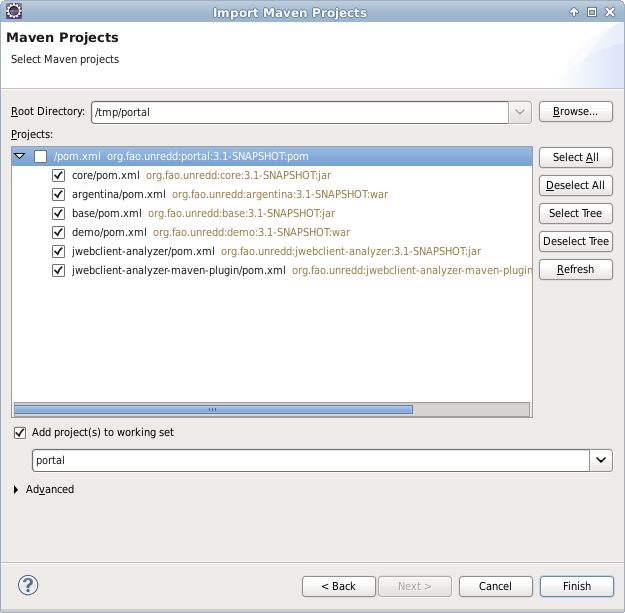

Compilación del proyecto
============================

Obtención de los fuentes
--------------------------

El código del portal se encuentra alojado en el siguiente repositorio de GitHub: https://github.com/nfms4redd/portal.

GitHub proporciona un servicio de GIT, un conocido sistema de control de versiones. Para aquellos que tengan conocimientos de uso de GIT, la URL del servicio es git@github.com:nfms4redd/portal.git. Bastaría con ejecutar la siguiente instrucción para tener una copia de los fuentes instalada en local::

	$ git clone git@github.com:nfms4redd/portal.git

En el caso de que no se quiera utilizar GIT, es posible descargarse un fichero zip con el estado actual del repositorio pulsando el botón "Download ZIP" que ofrece GitHub en la página del repositorio.

Hay que tener en cuenta que la rama por defecto, llamada "develop", es en la que se realizan los desarrollos y es posible que sea algo más inestable. En el combo "branch:" es posible elegir otras versiones del código fuente, como por ejemplo las ramas que comienzan por "release_" que son más estables.

Instalación de los fuentes en eclipse
--------------------------------------

Una vez el código fuente ha sido descargado, es necesario abrir Eclipse e importar un proyecto Maven existente mediante un clic con el botón derecho en el Project Explorer > Import > Import...

En el diálogo que aparece hay que decirle a Eclipse que el proyecto que queremos importar es un proyecto Maven. Así, habrá que seleccionar Maven > Existing Maven Projects

A continuación hay que seleccionar el directorio en el que hemos puesto el portal y darle a siguiente.

Tras este paso, nos aparecerá una ventana en la que podremos seleccionar los proyectos dentro del repositorio del portal que queremos importar:

Como se ve en la imagen, seleccionaremos todos menos el proyecto raíz y haremos clic en el botón de finalizar. Es posible que Eclipse instale algunos plugins tras esta acción.

.. warning::

	El repositorio del portal contiene varios proyectos correspondientes a la aplicación del portal, plugins, herramientas, etc. Para más información sobre cómo están organizados los proyectos dentro del repositorio ver :ref:`project_architecture`  

.. _app_execution_eclipse:

Ejecución del portal en tomcat desde Eclipse
------------------------------------------------

Para arrancar un Tomcat que contenga el portal, es necesario hacer clic derecho en uno de los proyectos aplicación (ver :ref:`project_architecture`), como ``demo``, y seleccionar en el menú contextual que aparece: Debug As > Debug on server.

En el caso de no tener un servidor instalado aparecerá un diálogo que nos permitirá definir un nuevo servidor. Seleccionaremos "Tomcat v7.0 Server" y en la siguiente pantalla seleccionaremos el directorio donde se encuentra nuestro Tomcat. Obviamente, es necesario haber descargado e instalado previamente un servidor Apache Tomcat 7.0.

Tras esta operación podremos aceptar el diálogo, tras lo cual el servidor se ejecutará y se abrirá una ventana dentro de eclipse con el portal. También debe ser posible acceder al mismo mediante la siguiente URL::

	http://localhost:8080/unredd-portal/

desde cualquier navegador web.

Generación del unredd-portal.war
--------------------------------------

Si lo que se pretende es exclusivamente obtener el fichero .war, es posible obviar Eclipse y utilizar directamente Maven desde línea de comandos::

 	$ mvn -DskipTests package

tras el cual el fichero demo/target/unredd-portal.war habrá aparecido. Dicho fichero se puede desplegar en el directorio ``webapps`` de Tomcat para poder usar la aplicación recién compilada.
