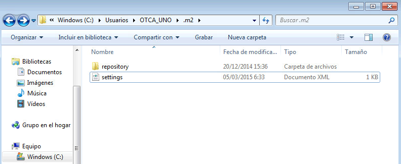

Publicación de un plugin en un repositorio Maven
==================================================

Para que los plugins desarrollados puedan ser reutilizados en otros desarrollos, ya sean propios o de terceras partes, es necesario subirlos a un repositorio Maven. Para ello modificaremos dos ficheros:

- El ``pom.xml`` de nuestro plugin
- El fichero de configuración ``settings.xml`` de Maven

Un repositorio Maven es una estructura de directorios que contiene los plugins y sus dependencias organizados por groupId y artifactId. El repositorio principal de Maven se encuentra en http://central.maven.org/maven2/ y contiene las librerías de uso general. Para los plugins y las librerías más específicas del portal REDD, FAO pone a disposición el servidor ``maven.nfms4redd.org``. Es este servidor el que podemos utilizar para subir nuestro plugin a un sitio accesibile.

Si hemos desarrollado un plugin, seguro que tenemos Maven ya configurado para que se descargue las dependencias del portal del repositorio de FAO. Pero ahora habrá que configurarlo para que, además de descargar los plugins, pueda subirlos.

Para subir los plugins al repositorio de FAO hay que utilizar el servicio ``ftp://maven.nfms4redd.org/repo``. Esto se configura en el pom.xml de nuestro plugin:

.. code-block:: xml

	<distributionManagement>
		<repository>
			<id>nfms4redd</id>
			<url>ftp://maven.nfms4redd.org/repo</url>
			<uniqueVersion>false</uniqueVersion>
		</repository>
	</distributionManagement>

Como no queremos poner en nuestro plugin el usuario y contraseña para acceder al FTP del servidor de FAO, lo que hacemos es especificar un identificador, en este caso ``nfms4redd``. Para decirle a Maven qué usuario y contraseña utilizar hay que editar el fichero ``settings.xml`` que se encuentra en el directorio ``.m2`` del "HOME" del usuario:

En dicho fichero, crearemos un elemento ``server`` con el mismo identificador que el especificado en el ``pom.xml`` del plugin. Y en ese elemento pondremos el usuario y contraseña.

.. code-block:: xml

	<settings xmlns="http://maven.apache.org/SETTINGS/1.0.0"
	      xmlns:xsi="http://www.w3.org/2001/XMLSchema-instance"
	      xsi:schemaLocation="http://maven.apache.org/SETTINGS/1.0.0
	                          http://maven.apache.org/xsd/settings-1.0.0.xsd">
		<servers>
			<server>
				<id>nfms4redd</id>
				<username>XXXXX</username>
				<password>XXXXX</password>
			</server>
		</servers>
	
	</settings>

Una vez la configuración está terminada, es necesario pedir a Maven que ejecute la tarea (goal) ``deploy``.

.. warning::

	Es posible que la ejecución de Maven falle si se ejecuta desde Eclipse y tenemos configurado sólo un JRE y no un JDK. En tal caso la solución es simple: instalar un JDK y utilizarlo por defecto.