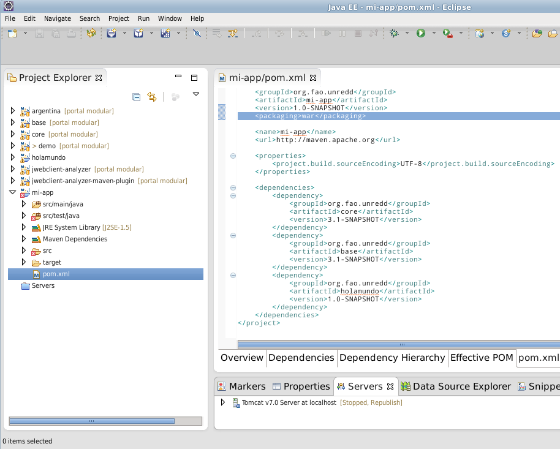
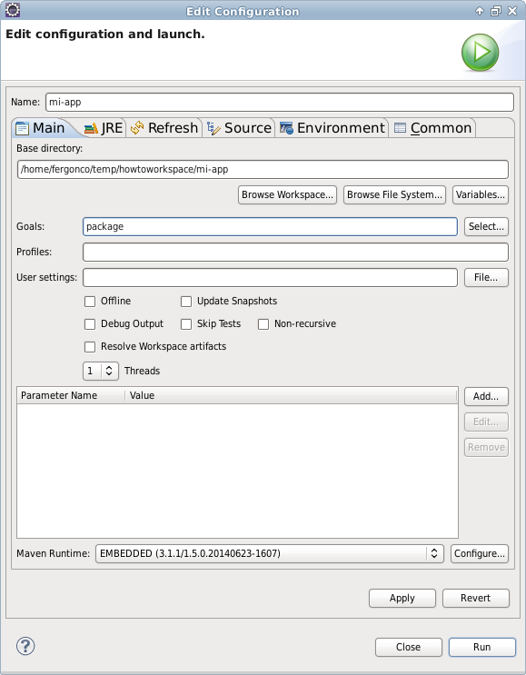

Cómo crear una nueva aplicación
================================

Creación del proyecto
------------------------

Cuando el objetivo es crear una aplicación que agrupe uno o más plugins existentes tenemos que crear un tipo de proyecto distinto (ver :ref:`application_project_structure` para información sobre los artefactos que tiene que tener un proyecto tal).

Al igual que en el caso de crear un nuevo plugin, lo primero es crear un nuevo proyecto maven. El proceso es idéntico a :ref:`maven_plugin_project_creation` sólo que utilizaremos "mi-app" como ``artifactId``.

La configuración de dicho proyecto en Eclipse es también realizada de forma idéntica al caso de los plugins: :ref:`maven_plugin_project_eclipse_import`.

Selección de los plugins que componen la aplicación
------------------------------------------------------

Una vez el proyecto está creado, es necesario especificar los plugins que van a utilizarse en la aplicación. Esto se hará de la misma manera que se hizo cuando se incluyó el plugin en la aplicación ``demo``, sólo que esta vez tenemos que incluir también la librería ``core``, que contiene el cargador de plugins:

En la imagen anterior, se puede observar cómo la sección de dependencias contiene la librería ``core``, el plugin ``base`` y el plugin que se creó en el manual anterior, ``holamundo``.

Ejecución de la aplicación desde eclipse
------------------------------------------

Para la ejecución del proyecto como aplicación web dentro de Eclipse tenemos que realizar dos configuraciones adicionales.

Lo primero es configurar el proyecto para que Eclipse entienda que es una aplicación web. Para ello hay que modificar el elemento ``packaging`` del fichero ``mi-app/pom.xml`` como se muestra en la imagen anterior, estableciendo el valor a "war". Tras editar el fichero abrá que clicar en el proyecto con botón derecho y seleccionar Maven > Update project.

A continuación es necesario proporcionar a la aplicación un directorio de configuración, que proporciona a la aplicación información sobre las capas del mapa, etc. Podemos tomar el que hay en ``demo/src/main/webapp/WEB-INF/default_config`` y copiarlo en ``mi-app/src/main/webapp/WEB-INF/default_config``.

Por último, para ejecutar la aplicación tendremos que operar como se muestra con ``demo`` en el punto :ref:`app_execution_eclipse`, pero con el proyecto ``mi-app`` que acabamos de crear.

Empaquetado
-------------

.. warning::

	Para que el proceso funcione es necesario que exista el descriptor de despliegue de aplicaciones JEE, el fichero ``src/main/webapp/WEB-INF/web.xml``. Bastaría con crear ese fichero con el siguiente contenido::
	
		<?xml version="1.0" encoding="UTF-8"?>
		<web-app version="2.5" xmlns="http://java.sun.com/xml/ns/javaee"
			xmlns:xsi="http://www.w3.org/2001/XMLSchema-instance"
			xsi:schemaLocation="http://java.sun.com/xml/ns/javaee http://java.sun.com/xml/ns/javaee/web-app_2_5.xsd">
		</web-app>

Para realizar el empaquetado tenemos que ejecutar el comando ``mvn package`` en el directorio ``mi-app``. Esto también se puede hacer desde Eclipse haciendo clic con el botón derecho en el proyecto ``mi-app`` y seleccionando Run As > Maven Build. En la ventana que aparece hay que especificar "package" en "Goals", como se puede ver en la siguiente imagen:

Al pinchar en el botón Run, Maven se ejecutará y mostrará por la consola el resultado. Cuando el proceso se termina con éxito se obtiene el fichero .war en el directorio ``target`` del proyecto y un mensaje similar a éste::

	[INFO] 
	[INFO] --- maven-war-plugin:2.2:war (default-war) @ mi-app ---
	[INFO] Packaging webapp
	[INFO] Assembling webapp [mi-app] in [/home/fergonco/temp/howtoworkspace/mi-app/target/mi-app-1.0-SNAPSHOT]
	[INFO] Processing war project
	[INFO] Copying webapp resources [/home/fergonco/temp/howtoworkspace/mi-app/src/main/webapp]
	[INFO] Webapp assembled in [172 msecs]
	[INFO] Building war: /home/fergonco/temp/howtoworkspace/mi-app/target/mi-app-1.0-SNAPSHOT.war
	[INFO] WEB-INF/web.xml already added, skipping
	[INFO] ------------------------------------------------------------------------
	[INFO] BUILD SUCCESS
	[INFO] ------------------------------------------------------------------------
	[INFO] Total time: 3.299s
	[INFO] Finished at: Thu Nov 06 11:40:09 CET 2014
	[INFO] Final Memory: 12M/172M
	[INFO] ------------------------------------------------------------------------

.. warning::

	Si la aplicación tiene como dependencia un plugin que hemos desarrollado nosotros, es necesario que dicho plugin esté disponible para Maven, lo cual se consigue ejecutando el goal "install" en dicho plugin.
	

Empaquetado con optimización
------------------------------

Cuando una aplicación tiene muchos módulos y librerías Javascript, hojas de estilo CSS, etc. la carga puede ser un poco lenta. Para acelerar esto se puede configurar Maven para que realice un proceso de optimización y combine todos estos ficheros en uno sólo.

Primero, hay que introducir la siguiente sección en el ``pom.xml`` de ``mi-app`` tras la sección ``<dependencies></dependencies>``::

	<build>
		<plugins>
			<plugin>
				<groupId>org.apache.maven.plugins</groupId>
				<artifactId>maven-dependency-plugin</artifactId>
				<version>2.8</version>
				<executions>
					<execution>
						<id>unpack-dependencies</id>
						<phase>prepare-package</phase>
						<goals>
							<goal>unpack-dependencies</goal>
						</goals>
						<configuration>
							<outputDirectory>${project.build.directory}/requirejs</outputDirectory>
						</configuration>
					</execution>
				</executions>
			</plugin>
			<plugin>
				<groupId>org.fao.unredd</groupId>
				<artifactId>jwebclient-analyzer-maven-plugin</artifactId>
				<version>3.1-SNAPSHOT</version>
				<executions>
					<execution>
						<id>generate-buildconfig</id>
						<phase>prepare-package</phase>
						<goals>
							<goal>generate-buildconfig</goal>
						</goals>
						<configuration>
							<webClientFolder>${project.build.directory}/requirejs/nfms</webClientFolder>
							<buildconfigOutputPath>${project.build.directory}/buildconfig.js</buildconfigOutputPath>
							<mainOutputPath>${project.build.directory}/requirejs/nfms/modules/main.js</mainOutputPath>
						</configuration>
					</execution>
				</executions>
			</plugin>
			<plugin>
				<groupId>ro.isdc.wro4j</groupId>
				<artifactId>wro4j-maven-plugin</artifactId>
				<version>1.7.6</version>
				<executions>
					<execution>
						<phase>prepare-package</phase>
						<goals>
							<goal>run</goal>
						</goals>
					</execution>
				</executions>
				<configuration>
					<wroManagerFactory>ro.isdc.wro.maven.plugin.manager.factory.ConfigurableWroManagerFactory</wroManagerFactory>
					<extraConfigFile>${basedir}/src/main/config/wro.properties</extraConfigFile>
					<targetGroups>portal-style</targetGroups>
					<minimize>true</minimize>
					<contextFolder>${basedir}/target/requirejs/nfms/</contextFolder>
					<destinationFolder>${basedir}/src/main/webapp/optimized/</destinationFolder>
					<wroFile>${basedir}/src/main/config/wro.xml</wroFile>
				</configuration>
			</plugin>
			<plugin>
				<groupId>com.github.bringking</groupId>
				<artifactId>requirejs-maven-plugin</artifactId>
				<version>2.0.5-SNAPSHOT</version>
				<executions>
					<execution>
						<phase>prepare-package</phase>
						<goals>
							<goal>optimize</goal>
						</goals>
					</execution>
				</executions>
				<configuration>
					<!-- optional path to a nodejs executable -->
					<!--<nodeExecutable> -->
					<!--/opt/nodejs/node -->
					<!--</nodeExecutable> -->
					<!-- path to optimizer json config file -->
					<configFiles>
						<configFile>${project.build.directory}/buildconfig.js</configFile>
					</configFiles>
					<fillDepsFromFolder>${project.build.directory}/requirejs/nfms/modules</fillDepsFromFolder>
					<!-- optional path to optimizer executable -->
					<!--<optimizerFile> -->
					<!--${basedir}/src/main/scripts/r.js -->
					<!--</optimizerFile> -->
					<!-- optional parameters to optimizer executable -->
					<optimizerParameters>
						<parameter>optimize=uglify</parameter>
						<!--<parameter>baseUrl=${baseDir}</parameter> -->
					</optimizerParameters>
					<!-- Whether or not to process configFile with maven filters. If you 
						use this option, some options in your configFile must resolve to absolute 
						paths (see below) -->
					<filterConfig>
						true
					</filterConfig>
					<!-- Skip requirejs optimization if true -->
					<skip>
						false
					</skip>
				</configuration>
			</plugin>
		</plugins>
	</build>

Esta configuración hace referencia a dos ficheros existentes en el directorio ``src/main/config``, ``wro.properties`` y ``wro.xml``. El contenido de ``wro.properties`` será::

	preProcessors=cssDataUri,cssImport,semicolonAppender,cssMinJawr
	postProcessors=

Mientras que para ``wro.xml`` pondremos::
	
	<?xml version="1.0" encoding="UTF-8"?>
	<groups xmlns="http://www.isdc.ro/wro"
	        xmlns:xsi="http://www.w3.org/2001/XMLSchema-instance"
	        xsi:schemaLocation="http://www.isdc.ro/wro wro.xsd">
	
	  <group name="portal-style">
	    <css>/modules/**.css</css>
	    <css>/styles/**.css</css>
	  </group>
	
	</groups>

Una vez realizada esta configuración, podemos generar el WAR de nuevo. Aparentemente este WAR es igual que el anterior, pero a diferencia de aquél, justo antes de empaquetar se habrán generado dos ficheros: ``src/main/webapp/optimized/portal.js`` y ``src/main/webapp/optimized/portal-style.css``, que incluyen respectivamente todo el código Javascript y todos los estilos de los plugins usados por la aplicación.

Cuando despleguemos tal WAR, podremos seleccionar poniendo la variable de entorno MINIFIED_JS a "true" el modo optimizado, que cargará el portal bastante más rápido.

