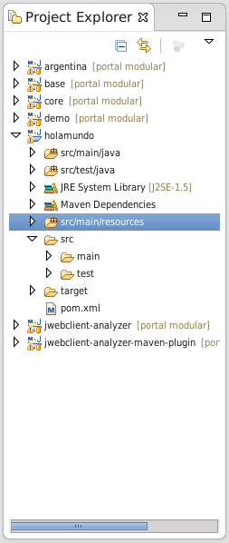
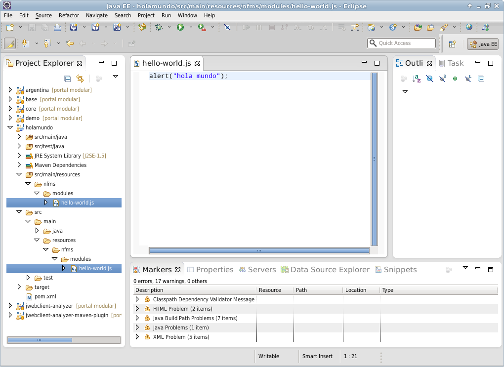
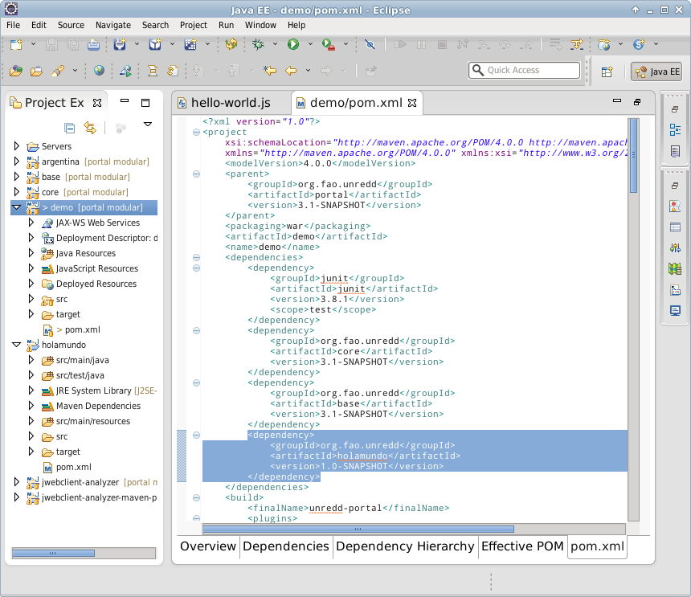
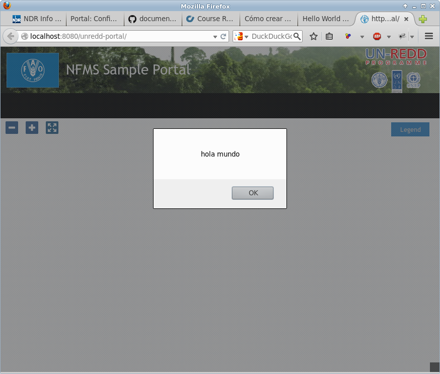

Cómo crear un nuevo plugin
================================

Cuando queremos realizar una implementación que se pueda utilizar fácilmente en portales existentes hay que empaquetar las funcionalidades en cuestión en un plugin.

.. _maven_plugin_project_creation:

Creación del proyecto para el plugin
--------------------------------------

Para ello hay que crear un nuevo proyecto con Maven. Escribiendo desde la línea de comandos::

	$ mvn archetype:generate

Dicho comando inicia un asistente que nos permitirá crear un proyecto fácilmente. Primero nos preguntará por el tipo de proyecto y versión del plugin de Maven. Nos valen los valores por defecto por lo que sólo pulsaremos INTRO un par de veces::

	Choose a number or apply filter (format: [groupId:]artifactId, case sensitive contains): 497: INTRO 
	
	Choose org.apache.maven.archetypes:maven-archetype-quickstart version: 
	1: 1.0-alpha-1
	2: 1.0-alpha-2
	3: 1.0-alpha-3
	4: 1.0-alpha-4
	5: 1.0
	6: 1.1
	Choose a number: 6: INTRO
	 
A continuación nos preguntará por el groupId y artifactId, que no es otra cosa que una manera de identificar el plugin. En este ejemplo usaremos respectivamente "org.fao.unredd" y "holamundo"::

	Define value for property 'groupId': : org.fao.unredd 
	Define value for property 'artifactId': : holamundo
	
Luego nos preguntará versión y paquete de Java que queremos crear. Podemos aceptar las opciones por defecto pulsando INTRO en cada caso::
	
	Define value for property 'version':  1.0-SNAPSHOT: : INTRO 
	Define value for property 'package':  org.fao.unredd: : INTRO

Por último nos pedirá confirmación. Pulsaremos INTRO de nuevo::

	Confirm properties configuration:
	groupId: org.fao.unredd
	artifactId: holamundo
	version: 1.0-SNAPSHOT
	package: org.fao.unredd
	 Y: : 
	[INFO] ----------------------------------------------------------------------------
	[INFO] Using following parameters for creating project from Old (1.x) Archetype: maven-archetype-quickstart:1.1
	[INFO] ----------------------------------------------------------------------------
	[INFO] Parameter: groupId, Value: org.fao.unredd
	[INFO] Parameter: packageName, Value: org.fao.unredd
	[INFO] Parameter: package, Value: org.fao.unredd
	[INFO] Parameter: artifactId, Value: holamundo
	[INFO] Parameter: basedir, Value: /tmp
	[INFO] Parameter: version, Value: 1.0-SNAPSHOT
	[INFO] project created from Old (1.x) Archetype in dir: /tmp/holamundo
	[INFO] ------------------------------------------------------------------------
	[INFO] BUILD SUCCESS
	[INFO] ------------------------------------------------------------------------
	[INFO] Total time: 4:16.288s
	[INFO] Finished at: Wed Nov 05 10:10:44 CET 2014
	[INFO] Final Memory: 15M/108M
	[INFO] ------------------------------------------------------------------------

Tras este proceso, Maven nos reporta BUILD SUCCESS, que quiere decir que el proyecto fue creado con éxito y está en un directorio con el mismo nombre que el ``artifactId``, es decir, "holamundo".

.. _maven_plugin_project_eclipse_import:

Configuración en Eclipse
-------------------------

Para empezar a escribir código, tendremos que importar el proyecto en algún entorno de desarrollo, como Eclipse. Para ello hacemos clic con el botón derecho en el Project Explorer > Import > Import...

En el diálogo que aparece hay que decirle a Eclipse que el proyecto que queremos importar es un proyecto Maven. Así, habrá que seleccionar Maven > Existing Maven Projects

A continuación hay que seleccionar el directorio que Maven acaba de crear y finalizar el asistente.

Para finalizar la importación en eclipse tendremos que crear el directorio ``src/main/resources`` que no viene creado por defecto pero que es donde se incluirán todos los desarrollos para la parte cliente (ver :ref:`plugin_project_structure`). Una vez creado habrá que hacer clic derecho en el proyecto y seleccionar Maven > Update project, tras lo cual src/main/resources aparecerá como un directorio de código:

Desarrollo de un módulo
-------------------------

Ahora que tenemos el proyecto en Eclipse podemos crear un módulo hola mundo. Los módulos tienen que estar en el directorio ``nfms/modules`` en ``src/main/resources`` por lo que tendremos que crear ese directorio. Dentro de ese directorio podemos crear el módulo, como se ve en la imagen:

.. _plugin_project_dependency:

Reutilización del módulo
-------------------------

Por último, queremos que nuestro plugin se incluya en alguna aplicación, por ejemplo ``demo``. Esto es tan fácil como incluir nuestro plugin como dependencia de ``demo``. Para ello abrimos el ``pom.xml`` de ``demo`` e incluimos una sección ``<dependency>`` adicional con los datos que introdujimos en nuestro plugin al inicio del manual:

Ahora sólo queda ejecutar ``demo`` en un servidor Tomcat y ver el resultado:

