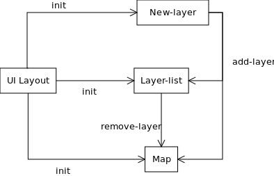
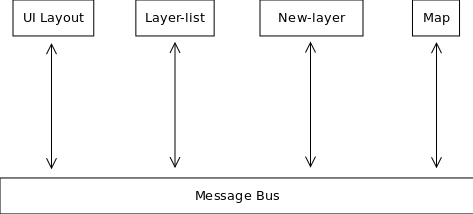

.. _message-bus:

Patrón de diseño ``message-bus``
================================

El patrón de diseño Message Bus permite desacoplar los componentes que forman una aplicación. En una aplicación modular, los distintos componentes necesitan interactuar entre sí. Si el acoplamiento es directo, la aplicación deja de ser modular ya que aparecen dependencias, con frecuencia recíprocas, entre los distintos módulos y no es posible realizar cambios a un módulo sin que otros se vean afectados.

En cambio, si los objetos se acoplan a través de un objeto intermediario (Message Bus), casi todas las dependencias desaparecen, dejando sólo aquellas que hay entre el Message Bus y los distintos módulos.

En el siguiente ejemplo vemos una hipotética aplicación modular que consta de tres componentes con representación gráfica y que están dispuestos de la siguiente manera:

* Map: En la parte central (verde) hay un mapa que muestra cartografía de España.
* LayerList: En la parte izquierda (rojo) hay una lista de temas. Vemos que sólo hay un tema de catastro, que es el que se visualiza en el mapa.
* NewLayer: En la parte superior (azul) existe un control que permite añadir temas a los otros dos componentes.

Un posible diseño de dicha página consistiría en un módulo ``Layout`` que maqueta la página HTML y que inicializa los otros tres objetos. En respuesta a la acción del usuario, el objeto NewLayer mandaría un mensaje a LayerList y Map para añadir el tema en ambos componentes. De la misma manera, LayerList podría mandar un mensaje a Map en caso de que se permitiera la eliminación de capas desde aquél. El siguiente grafo muestra los mensajes que se pasarían los distintos objetos:

Es posible observar como en el caso de que se quisiera quitar el módulo LayerList, sería necesario modificar el objeto Layout así como el objeto NewLayer, ya que están directamente acoplados. Sin embargo, con el uso del Message Bus, sería posible hacer que los distintos objetos no se referenciaran entre sí directamente sino a través del Message Bus:

Así, el módulo NewLayer mandaría un mensaje al Message Bus con los datos de la nueva capa y Map y LayerList símplemente escucharían el mensaje y reaccionarían convenientemente. Sería trivial quitar de la página LayerList ya que no hay ninguna referencia directa al mismo (salvo tal vez en Layout).

Y al contrario: sería posible incluir un nuevo módulo, por ejemplo un mapa adicional, y que ambos escuchasen el evento “add-layer” de forma que se añadirían los temas a ambos mapas.

De esta manera la aplicación es totalmente modular: es posible reemplazar módulos sin que los otros módulos se vean afectados, se pueden realizar contribuciones bien definidas que sólo deben entender los mensajes existentes para poder integrarse en la aplicación, etc.

TODO referenciar los ejemplos del taller de desarrollo.
