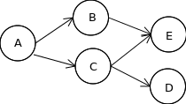

RequireJS
=========

RequireJS es una librería que permite encapsular en módulos nuestro código JavaScript y cargarlos bajo demanda (llamada ``require``).

Para ello es necesario cargar la librería RequireJS en el código HTML de la página en la que se va a utilizar::

	<html>
	<head>
	
	</head>
	<body>
	</body>
	</html>

En el tag de carga se especifica el módulo inicial que RequireJS cargará y ejecutará. En el ejemplo "modules/main.js".

Árbol de dependencias
----------------------

Típicamente los módulos consisten en una llamada a ``define``, que toma una lista de los módulos y una función de inicialización que se ejecuta cuando las dependencias están satisfechas::

	define([ "map" ], function(map) {
		alert("este módulo depende del módulo" 
			+ "map y en este punto map ha sido"
			+ "cargado e inicializado");
	});

La función obtiene recibe como parámetros referencias a los módulos que se definen como dependencias, en el mismo orden::

	define([ "layer-list", "map" ], function(layerList, map) {
		// layerList apunta al módulo "layer-list"
		// map apunta al módulo "map"
	});

pero el orden de carga puede variar, ya que por ejemplo, en el caso anterior otro módulo puede haber cargado ya ``layer-list``. RequireJS analiza las llamadas define y crea un árbol de dependencias que se cargan en cualquier orden que garantice que las dependencias de un módulo estén todas cargadas e inicializadas cuando el módulo que depende de ellas se inicializa.

De forma más visual:

para cargar A requireJS realiza una secuencia similar a esta:

- Se detecta la dependencia de A en B y C por lo que pasa a intentar cargarlos.
- Se intentar cargar B pero B depende de E, por lo que se intenta cargar E.
- Como E no tiene ninguna dependencia se cargar directamente y se llama a su código de inicialización.
- Ahora que B tiene todas sus dependencias satisfechas se ejecuta su código de incialización.
- RequireJS pasa a cargar C, pero detecta la dependencia en D y en E y, como E ya ha sido cargada, pasa a cargar D.
- Como D no tiene ninguna dependencia se cargar directamente y se llama a su código de inicialización.
- Ahora C tiene sus dos dependencias ya cargadas, por lo que se llama a su código de incialización.
- Con B y C ya cargados se pasa a ejecutar el código de inicialización de A.

En la secuencia anterior se ilustra por una parte el hecho de que los módulos en los que depende un módulo son cargados e inicializados previamente. Por otra parte, se muestra que el orden de carga de las dependencias de un módulo no corresponde con el orden en el que están definidas en el código. Por ejemplo, en el caso de C primero se cargó E antes que D porque la dependencia fue cargada por B previamente.

Dependencias de módulos no-RequireJS
------------------------------------

En el caso de un módulo que dependa de librerías que no son módulos RequireJS (jquery, openlayers, etc.) es todavía necesario especificar las dependencias, ya que de lo contrario RequireJS puede cargarlas arbitrariamente antes o después. En caso de hacerlo después, el módulo intentará utilizar una librería que no está cargada y se producirá un error.

La forma de especificar la dependencia un modulo tal es idéntica a la de los modulos RequireJS::

	define([ "jquery" ], function($) {
		alert("este módulo depende de jQuery" 
			+ "y en este punto jQuery ha sido"
			+ "cargado e inicializado");
	});

pero ¿de dónde saca RequireJS el código de jQuery? No lo puede obtener de ningún sitio, por lo que hay que especificárselo. El módulo ``main``, que es el módulo de entrada, es el encargado de realizar esta configuración::

	require.config({
		baseUrl : "modules",
		paths : {
			"jquery" : "http://ajax.googleapis.com/ajax/libs/jquery/2.0.3/jquery.min",
			"jquery-ui" : "http://ajax.googleapis.com/ajax/libs/jqueryui/1.10.3/jquery-ui.min",
			"fancy-box" : "../js/jquery.fancybox.pack",
			"openlayers" : "../js/OpenLayers/OpenLayers.debug"
		},
		shim : {
			"fancy-box" : [ "jquery" ]
		}
	});

En el código de ``main`` se puede observar cómo hay una llamada al método ``require.config`` que incluye un elemento cuya propiedad ``paths`` incluye las direcciones de las cuales puede descargar RequireJS cada librería.

También se puede observar cómo en la propiedad ``shim`` se establecen las dependencias entre módulos no-RequireJS.

Valores de retorno
------------------

Se ha mostrado anteriormente cómo las dependencias de un módulo son recibidas como parámetro en la función de inicialización::

	define([ "layer-list", "map" ], function(layerList, map) {
		// layerList apunta al módulo "layer-list"
		// map apunta al módulo "map"
	});

pero, ¿qué contienen exactamente estas referencias?

Contienen el valor que retorna la función de inicialización del módulo dependencia. Por ejemplo, el siguiente módulo ``map`` en su función de inicialización crea un mapa OpenLayers, añade una capa y la devuelve::

	define([ "openlayers" ], function() {
	
		var mimapa = new OpenLayers.Map("map");
		mimapa.addLayer(new OpenLayers.Layer.WMS("OpenLayers WMS", "http://vmap0.tiles.osgeo.org/wms/vmap0?", {
			layers : "basic"
		}));
				
		return mimapa;
	});

Por tanto, cuando el siguiente módulo establezca la dependencia::

	define([ "map" ], function(map) {
		map.setCenter(new OpenLayers.LonLat(-84, 0), 6);
	});

el valor de la variable ``map`` que se pasará a la función de inicialización de éste será el mapa OpenLayers que se creó en el módulo ``map`` anterior.

Funciones públicas
-------------------

A veces un módulo debe permitir que los módulos que dependen de él realicen algunas operaciones sobre el mismo. Más adelante se verá que existe otra manera que frecuentemente es mejor, pero de momento mostramos otra manera que también puede ser útil en un momento dado.

Por ejemplo, si queremos hacer un módulo ``error`` para manejar los errores de la aplicación mostrando un diálogo al usuario y escribiendo el problema en la consola tendríamos una función como ésta::

	function(errorMsg) {
		console.log(errorMsg);
		alert(errorMsg);
	});

Para poder utilizar este módulo tendremos que importarlo en las dependencias de nuestro módulo y cuando se produzca la condición del error hacer una llamada a dicho módulo::

	define([ "error" ], function(error) {
		if (condicion) {
			error.showMessage("Se ha cumplido una condición de error");
		}
	});

Pero para esto tendríamos que devolver un objeto en el módulo ``error`` que tenga una función ``showMessage``. Esto podría hacerse teniendo un módulo ``error`` como el siguiente::

	define([], function() {
		return {
			showMessage : function(errorMsg) {
				console.log(errorMsg);
				alert(errorMsg);
			}
		};
	});

cuyo valor de retorno tiene una propiedad showMessage que es la función de error.

Funciones privadas
---------------------

Es posible definir funciones privadas dentro del módulo. Para ello basta con definir las funciones antes del valor de retorno del módulo::

	define([ "openlayers" ], function() {
	
		function createLayer(name, url, wmsName) {
			return new OpenLayers.Layer.WMS(name, url, {
				layers : wmsName,
				transparent : true
			});
		}
	
		var mimapa = new OpenLayers.Map("map");
		mimapa.addLayer(createLayer("Basic", "http://vmap0.tiles.osgeo.org/wms/vmap0?", "basic");
		mimapa.addLayer(createLayer("Costa", "http://vmap0.tiles.osgeo.org/wms/vmap0?", "coastline_01");
				
		return mimapa;
	});

En el ejemplo anterior se define una función ``createLayer`` y a continuación se le invoca un par de veces para instanciar las capas WMS que se añaden al mapa.

.. _plantillamodelo:

Plantilla módulo
----------------

A continuación se presenta una plantilla que puede ser útil para la creación de nuevos módulos::

	define([ "dependencia1", "dependencia2" ], function(modulo1, modulo2) {
		
		// // variables privadas
		// var miVariablePrivada = ...;
				
		// // funciones privadas
		// function miFuncionPrivada() {
		// }
		
		// // inicialización
		
		// // valor de retorno
		// return {
			
			// propiedades públicas
			miPropiedadPublica : ...,
			
			// Funciones públicas
			miFuncionPublica : function() {
			}
			
		};
	});
