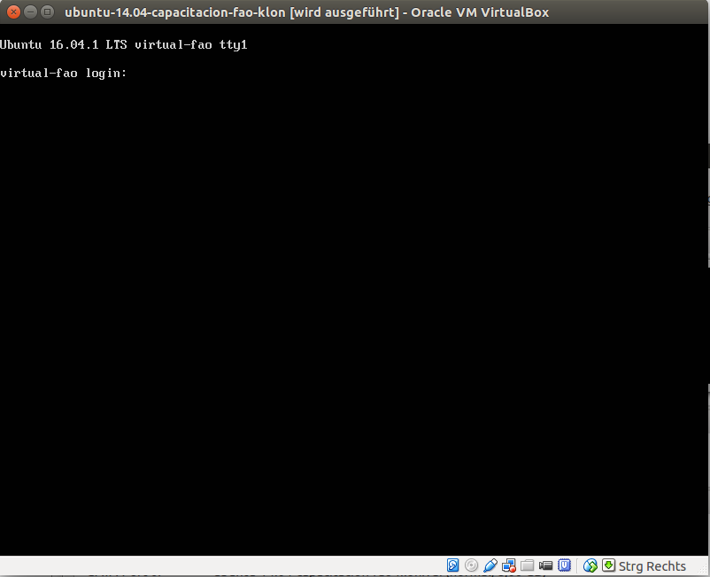
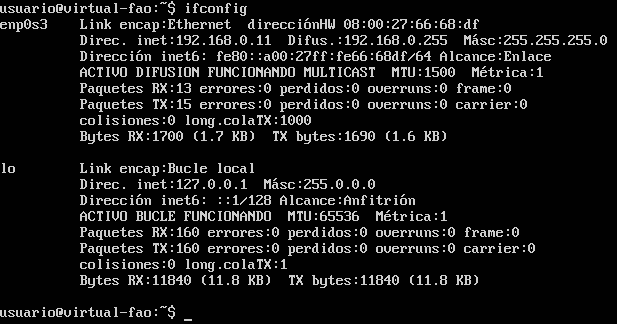

# Curso programación sobre el portal de diseminación del Sistema Nacional de Monitoreo de Bosques (SNMB)

Este tutorial muestra cómo realizar aplicaciones web de forma modular con el proyecto [Geoladris](https://github.com/geoladris/) usando como caso de uso el portal de diseminación del SNMB.

La tecnología utilizada no es específica para la temática de bosques y la modularidad de Geoladris permite adaptar el portal fácilmente a otras temáticas.

## Servidor de pruebas

Se realizarán distintos ejercicios que consisten en cambiar la configuración de programas instalados en un servidor.

Se parte de la existencia de un servidor linux (ubuntu 14.04, aunque este detalle no es
significativo para la mayor parte de los ejemplos) en el que tenemos una cuenta "usuario" con
acceso de superusuario y password "capacitacion".

Para el acceso al servidor necesitaremos:

* Un cliente de SSH.
    * En linux, la línea de comando habitual y el comando `ssh`.
    * En Windows podemos utilizar PuTTY (http://www.chiark.greenend.org.uk/~sgtatham/putty/download.html).
* Una herramienta para copiar archivos al servidor.
     * En linux, de nuevo a través de la línea de comando
     * En Windows podemos utilizar WinSCP (http://winscp.net).

### Máquina virtual

En caso de tener el servidor en una máquina virtual es necesario averiguar la IP para poder conectar.

Al arrancar veremos la siguiente pantalla de login:

En dicha pantalla podemos introducir los datos de nuestro usuario y luego teclear el
comando `ifconfig`, que nos dará la dirección de la máquina (segunda línea en la imagen):

Una vez tenemos la dirección IP podemos usar el cliente SSH que queramos para conectar a esa IP. Por
ejemplo, desde la línea de comandos de linux:

	fergonco@fergonkitude:~$ ssh usuario@192.168.0.11
	usuario@192.168.0.11's password: 
	Welcome to Ubuntu 16.04.1 LTS (GNU/Linux 4.4.0-38-generic x86_64)
	
	 * Documentation:  https://help.ubuntu.com
	 * Management:     https://landscape.canonical.com
	 * Support:        https://ubuntu.com/advantage
	
	Pueden actualizarse 2 paquetes.
	0 actualizaciones son de seguridad.
	
	
	Last login: Mon Oct  3 09:38:06 2016
	usuario@virtual-fao:~$ _ 

## Contenidos

Este tutorial consta de dos partes:

1. [Comprensión del ciclo de vida y configuración del .war. Java a nivel administrador](wars.md)
2. [Creación de plugins sobre el portal: HTML + CSS + Javascript](programmer.md)

